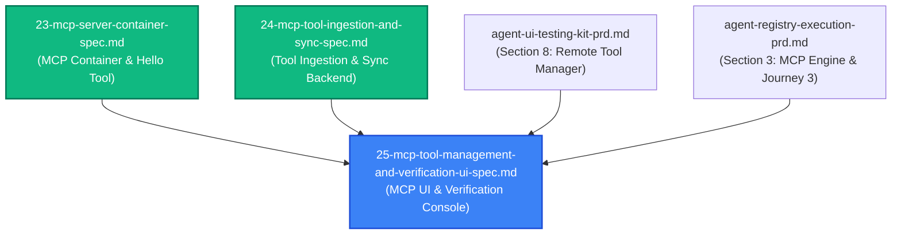

# Spec 25: MCP Tool Management & Interactive Verification UI

**Status**: `draft`

---

## Overview & Scope
This specification defines the implementation of the **MCP Tool Management & Interactive Verification UI** in [`aad-fe-container`](../prds/agent-ui-testing-kit-prd.md) and its supporting backend verification bridge in [`aad-be-container`](../prds/agent-registry-execution-prd.md).

Prior to this specification, remote MCP tool servers registered via `/tools` defaulted to legacy streaming transports (`sse`), lacked live schema inspection in the main details view, lacked an in-UI on-demand synchronization trigger, and required manual terminal `curl` commands to verify that remote tools functioned correctly.

This specification delivers:
1. **HTTP Transport Selection**: Enables first-class registration of stateless `HTTP (JSON-RPC 2.0 Streamable HTTP)` transport across Kubernetes / Istio service mesh environments.
2. **On-Demand Schema Synchronization ("Sync Now")**: A one-click synchronization action with in-flight loading spinner, updating PostgreSQL and reloading active tool schemas.
3. **Discovered Tools & Schema Inspector**: Live visualization of all tools parsed into `cached_capabilities.tools`, detailing descriptions and JSON Schema parameter requirements.
4. **Interactive In-Browser Tool Verification Console**: Direct tool execution bridge (`POST /{{api_prefix}}/v1/agents/tools/:id/test`) and an interactive testing panel allowing developers to execute remote tools (e.g. `hello` from `aad-mcp-container`), observe execution latency, and verify formatted and raw JSON-RPC outputs.

---

## Dependencies & PRD References
- **Primary PRDs**:
  - [Agent UI Testing Kit PRD](../prds/agent-ui-testing-kit-prd.md) (Section 8: Remote Tool Manager)
  - [Agent Registry & Execution PRD](../prds/agent-registry-execution-prd.md) (Section 3: Remote MCP Tool Registration, Synchronization & Execution Engine)
- **Predecessor Specs**:
  - [23-mcp-server-container-spec.md](./23-mcp-server-container-spec.md) (Dedicated MCP Server Container)
  - [24-mcp-tool-ingestion-and-sync-spec.md](./24-mcp-tool-ingestion-and-sync-spec.md) (MCP Tool Ingestion, Handshake & Sync Engine)



---

## 1. Backend Verification API Specification

### Endpoint: `POST /{{api_prefix}}/v1/agents/tools/{id}/test`

Allows direct execution of any tool belonging to a registered MCP server without invoking full LLM agent completions.

#### Request Payload
```json
{
  "tool_name": "hello",
  "arguments": {
    "name": "Antigravity"
  }
}
```

#### Request Validation & Operational Lifecycle
1. Fetch tool server record by `id` from PostgreSQL `tools` table. Return `404 Not Found` if missing.
2. Verify that `tool_name` exists in `cached_capabilities.tools`. Return `422 Unprocessable Entity` (`"Tool 'xyz' not found in server capabilities"`) if missing.
3. Extract `endpoint_config.url`. Return `400 Bad Request` if missing.
4. Record start timestamp ($t_0$).
5. Forward JSON-RPC 2.0 `tools/call` to `url`:
   ```json
   {
     "jsonrpc": "2.0",
     "id": "<uuid>",
     "method": "tools/call",
     "params": {
       "name": "hello",
       "arguments": { "name": "Antigravity" }
     }
   }
   ```
6. Record end timestamp ($t_1$) and calculate `latency_ms = t1 - t0`.
7. If remote server fails to respond or returns HTTP 5xx, return `502 Bad Gateway` (`"Remote MCP server communication failed"`).
8. Parse JSON-RPC response:
   - If `isError: true`, return `200 OK` with:
     ```json
     {
       "success": false,
       "tool_name": "hello",
       "error": "Error message from tool",
       "raw_result": { ... },
       "latency_ms": 35
     }
     ```
   - If successful, extract text output from `content[0].text` and return `200 OK`:
     ```json
     {
       "success": true,
       "tool_name": "hello",
       "output": "Hello, Antigravity!",
       "raw_result": {
         "content": [
           { "type": "text", "text": "Hello, Antigravity!" }
         ],
         "isError": false
       },
       "latency_ms": 12
     }
     ```

---

## 2. Frontend Interface Specifications (`ToolManagerComponent`)

### 1. Transport Protocol Selection
- In `tool-manager.component.html`, update the Transport Protocol select field:
  - `<mat-option value="http">HTTP (JSON-RPC 2.0 Streamable HTTP - Recommended)</mat-option>`
  - `<mat-option value="sse">SSE (Server-Sent Events HTTP)</mat-option>`
  - `<mat-option value="stdio">Stdio (Standard Input/Output Command)</mat-option>`
- Default new tool registrations to `transport_type: 'http'` and endpoint placeholder to `http://localhost:8082`.

### 2. On-Demand Synchronization ("Sync Now")
- In the tool details header, add a **"Sync Now"** button (`mat-stroked-button`) with an icon (`sync`).
- When clicked:
  - Shows spinning animation on the sync icon.
  - Calls `apiService.syncTool(server.id)`.
  - On success: refreshes tool cache count, updates `last_synced` to "Just now", updates `sync_status` to `"synced"`, and displays a success snackbar: `"Successfully synced X tools from <server_name>"`.
  - On failure: updates `sync_status` to `"degraded"`, displays snackbar warning, and surfaces error diagnostics.

### 3. Sync Health & Status Indicators
- Render a status badge adjacent to the server version:
  - **`synced`**: Emerald badge (`bg-emerald-50 text-emerald-700 border-emerald-200`) with check icon.
  - **`degraded`**: Amber/red badge (`bg-amber-50 text-amber-700 border-amber-200`) with warning icon and hover tooltip displaying `last_sync_error`.
  - **`syncing`**: Indigo badge (`bg-indigo-50 text-indigo-700 border-indigo-200`) with spinning sync icon.

### 4. Discovered Tools & Schema Inspector
- Add a dedicated **"Discovered Capabilities (N Tools)"** section below the connection settings.
- For each tool in `cached_capabilities.tools`:
  - **Header**: Tool name in monospace (`hello`), description snippet, and a **"Test Tool"** action button.
  - **Schema Inspector**: Expandable panel revealing:
    - Required parameters list.
    - Parameter properties table (Name, Type, Description, Required badge).
    - Raw JSON Schema preview in an expandable drawer.

### 5. Interactive In-Browser Tool Verification Console
- Clicking **"Test Tool"** opens an interactive testing drawer or card modal:
  - **Pre-populated Parameters**: Automatically populates sample arguments based on `inputSchema` (e.g. for `hello` with required property `name: string`, populates `{"name": "World"}`).
  - **Editable Arguments**: JSON code editor or textarea with syntax validation.
  - **Execution Action**: **"Execute Tool"** button with in-flight spinner.
  - **Response Display**:
    - Status pill (`Success` in emerald or `Error` in red).
    - Latency tag (`e.g. 18ms`).
    - Formatted Result Box displaying text output.
    - Expandable Raw JSON-RPC Response payload.

---

## 3. Test Strategy & Acceptance Criteria

### Backend TDD Suite (`webserver/tools.rs`)
1. **`test_tool_verification_success`**:
   - Mock Axum server returns `tools/call` response for `hello`.
   - Register tool server and execute `POST /{{api_prefix}}/v1/agents/tools/{id}/test`.
   - Assert `200 OK`, `success: true`, `output: "Hello, Developer!"`, and `latency_ms >= 0`.
2. **`test_tool_verification_unknown_tool_fails_fast`**:
   - Attempt to execute a non-existent tool `unknown_tool`.
   - Assert `422 Unprocessable Entity` with explanatory error message.
3. **`test_tool_verification_unreachable_server_fails_safely`**:
   - Register tool with unreachable endpoint.
   - Execute verification test.
   - Assert `502 Bad Gateway` error and no panic.
4. **`test_tool_verification_remote_error_handling`**:
   - Mock server returns `isError: true` with error content.
   - Assert `200 OK` with `success: false` and extracted error message.

### Frontend Unit & Component Tests (`tool-manager.component.spec.ts`)
1. **Transport Type Defaulting**:
   - Verify `startNewServer()` sets `transport_type: 'http'`.
2. **On-Demand Sync Trigger**:
   - Spy on `apiService.syncTool`.
   - Click "Sync Now" button and assert service called with active server ID.
   - Verify tool count and status badge update on completion.
3. **Discovered Tools Rendering**:
   - Supply mock server with `cached_capabilities.tools` containing `hello`.
   - Assert tool name, description, and schema properties render in the DOM.
4. **Interactive Verification Flow**:
   - Open verification console for `hello`.
   - Trigger tool execution.
   - Verify `apiService.testTool` called with arguments.
   - Assert latency badge and output text display upon resolution.
