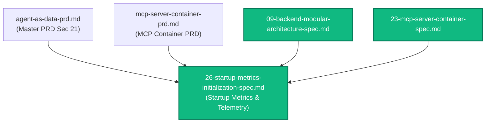
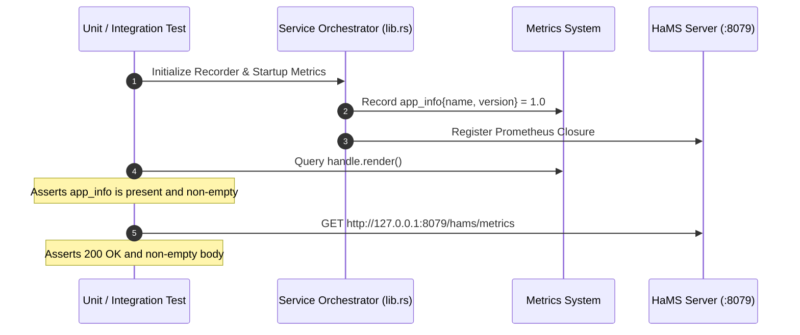

# Spec 26: Baseline Startup Metrics Initialization & Telemetry Instrumentation

**Status**: `complete`

---

## Overview & Scope
This specification defines the implementation of **Baseline Startup Metrics Initialization and HTTP Telemetry Instrumentation** across both the backend microservice (**`aad-be-container`**) and the Model Context Protocol server (**`aad-mcp-container`**).

Prior to this specification, `axum-prometheus` only emitted metrics lazily upon the arrival of inbound HTTP requests. Consequently, in freshly booted containers or cluster environments where readiness probes query HaMS (`:8079/hams/ready`) rather than the API port, `GET /hams/metrics` returned `0` bytes (`content-length: 0`). When Istio Envoy sidecars scraped `:15020/stats/prometheus`, `pilot-agent` merged 0 application metrics with Envoy's metrics, leaving only Envoy internal stats visible.

This spec establishes:
1. **Immediate Baseline Telemetry**: At startup upon Prometheus recorder installation, services register an `app_info` gauge metric (`app_info{name="...", version="..."} = 1.0`).
2. **Safe HaMS Prometheus Registration**: Replaces unsafe stack pointer dereferencing with native closure registration (`register_prometheus_closure`) capturing an `Arc<PrometheusHandle>`.
3. **MCP HTTP Telemetry Layer**: Instruments `aad-mcp-container` Axum HTTP transport endpoints with `PrometheusMetricLayer`.
4. **Comprehensive Test Coverage**: Unit and integration tests guaranteeing that `GET /hams/metrics` returns non-empty Prometheus exposition text from the moment the process starts, before any external HTTP traffic is received.

---

## Dependencies & PRD References
- **PRD Reference**: [Master PRD (Section 21)](../prds/agent-as-data-prd.md)
- **PRD Reference**: [MCP Server Container PRD](../prds/mcp-server-container-prd.md)
- **Architectural Reference**: [09-backend-modular-architecture-spec.md](./09-backend-modular-architecture-spec.md)
- **MCP Architectural Reference**: [23-mcp-server-container-spec.md](./23-mcp-server-container-spec.md)



---

## 1. Technical Design & Implementation Details

### 1.1 Baseline Metric Contract: `app_info`
Each container emits an `app_info` metric immediately following recorder registration:

```prometheus
# HELP app_info Application build and runtime metadata
# TYPE app_info gauge
app_info{name="aad-be",version="0.1.0"} 1
```

For MCP container:
```prometheus
# HELP app_info Application build and runtime metadata
# TYPE app_info gauge
app_info{name="aad-mcp",version="0.1.0"} 1
```

### 1.2 Safe HaMS Prometheus Hook
Instead of passing raw C pointers to an unpinned `AppState` stack struct (`&app_state as *const _ as *const c_void`), both services will use `hams.register_prometheus_closure`:

```rust
let handle_clone = Arc::clone(&app_state.prometheus_handle);
hams_harness.hams.register_prometheus_closure(move || {
    handle_clone.render()
}).map_err(|e| format!("Failed to register Prometheus with HaMS: {e}"))?;
```

The C-FFI functions (`prometheus_response_mystate`, `prometheus_response_free`) will be retained in `metrics.rs` for backwards-compatibility testing and external FFI callers.

### 1.3 MCP HTTP Metric Layer Instrumentation
In `aad-mcp-container/src/webserver/mod.rs`:
- Apply `PrometheusMetricLayer::new()` to `Router::new()` in `create_app`.
- Ensure routes (`/`, `/mcp`, `/healthz`, `/api/v1/mcp`) pass through the layer.

---

## 2. Test Strategy



### 2.1 Backend (`aad-be-container`) Tests
1. **Unit Test (`src/metrics.rs`)**:
   - Verify `init_startup_metrics(name, version)` emits `app_info`.
   - Verify `handle.render()` contains `app_info{name="aad-be",version=...} 1`.
2. **Integration Test (`tests/` or end-to-end)**:
   - Start HaMS harness and register closure with Prometheus handle.
   - Perform `GET /hams/metrics` before sending any HTTP requests.
   - Assert `200 OK`, `Content-Type: text/plain; version=0.0.4`, and body contains `app_info`.

### 2.2 MCP (`aad-mcp-container`) Tests
1. **Unit Test (`src/metrics.rs`)**:
   - Verify `init_startup_metrics(name, version)` emits `app_info`.
   - Verify `handle.render()` contains `app_info{name="aad-mcp",version=...} 1`.
2. **HTTP Metrics Integration Test (`tests/mcp_rpc_tests.rs`)**:
   - Send HTTP request to `/healthz`.
   - Assert `axum_http_requests_total` is incremented.
