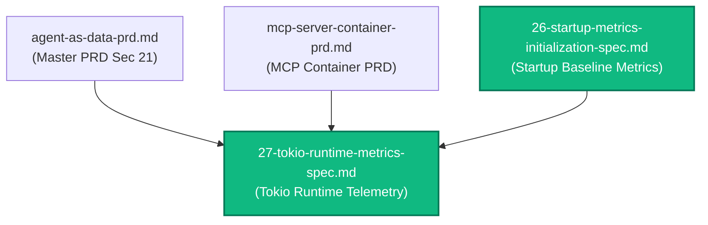
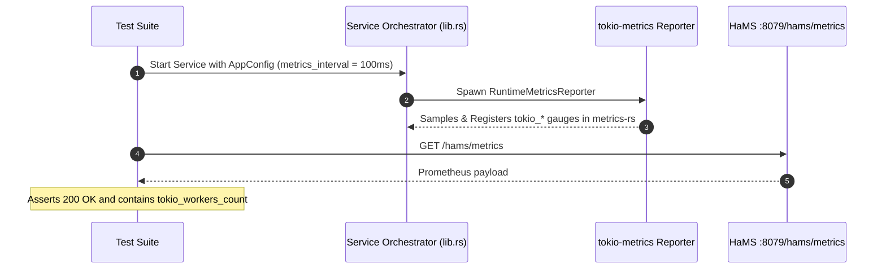

# Spec 27: Tokio Runtime Metrics Telemetry Instrumentation via `tokio-metrics`

**Status**: `complete`

---

## Overview & Scope
This specification defines the implementation of automated **Tokio Runtime Metrics Telemetry** across both the backend microservice (**`aad-be-container`**) and the Model Context Protocol server (**`aad-mcp-container`**) by integrating the **`tokio-metrics`** crate with the `metrics-rs-integration` feature.

Prior to this specification, manual line-by-line gauge formatting was attempted on scrape, which was brittle, omitted critical scheduler metrics, and risked falling out of sync with Tokio internal improvements. By adopting `tokio-metrics`, both containers periodically sample and push runtime scheduler telemetry (e.g. worker counts, queue depths, active tasks, stealing/park events) directly into the global `metrics` recorder (`metrics-rs`), allowing HaMS's `/hams/metrics` endpoint (`handle.render()`) to naturally emit comprehensive runtime metrics without custom string interpolation.

This spec establishes:
1. **Configurable Telemetry Interval**: Exposing `metrics_interval` in `ThreadRuntime` within centralized `AppConfig`, overridable via `AAD_BE__RUNTIME__METRICS_INTERVAL` and `AAD_MCP__RUNTIME__METRICS_INTERVAL` with fail-fast validation.
2. **`tokio-metrics` Integration**: Adding `tokio-metrics = { version = "0.5", features = ["metrics-rs-integration"] }` to `aad-be-container` and `aad-mcp-container`.
3. **Automated Background Reporter**: Spawning `tokio_metrics::RuntimeMetricsReporterBuilder` at startup in `service_main`.
4. **Clean HaMS Prometheus Exposition**: Relying on standard `handle.render()` to expose `tokio_*` metrics alongside `app_info` and domain metrics.
5. **Comprehensive TDD Test Coverage**: Validating configuration parsing, fail-fast validation, reporter startup, and `/hams/metrics` telemetry output.

---

## Dependencies & PRD References
- **PRD Reference**: [Master PRD (Section 21)](../prds/agent-as-data-prd.md)
- **PRD Reference**: [MCP Server Container PRD](../prds/mcp-server-container-prd.md)
- **Architectural Reference**: [09-backend-modular-architecture-spec.md](./09-backend-modular-architecture-spec.md)
- **MCP Architectural Reference**: [23-mcp-server-container-spec.md](./23-mcp-server-container-spec.md)
- **Startup Metrics Reference**: [26-startup-metrics-initialization-spec.md](./26-startup-metrics-initialization-spec.md)



---

## 1. Technical Design & Implementation Details

### 1.1 Configurable Metrics Interval in `ThreadRuntime`
In both `aad-be-container/src/tokio_tools.rs` and `aad-mcp-container/src/tokio_tools.rs`:
```rust
#[derive(Deserialize, Serialize, Debug, Clone)]
pub struct ThreadRuntime {
    pub threads: usize,
    pub stack_size: usize,
    pub name: String,
    #[serde(default = "default_metrics_interval", with = "humantime_serde")]
    pub metrics_interval: Duration,
}

fn default_metrics_interval() -> Duration {
    Duration::from_secs(5)
}
```

In `AppConfig::validate()` for both services:
```rust
if self.runtime.metrics_interval.is_zero() {
    return Err("Runtime metrics_interval must be greater than 0".to_string());
}
```

In `config/default.yaml` and Helm charts:
```yaml
runtime:
  threads: 4
  stack_size: 3000000
  name: "aad-worker"
  metrics_interval: "5s"
```

### 1.2 Cargo Dependencies
In `aad-be-container/Cargo.toml` and `aad-mcp-container/Cargo.toml`:
```toml
tokio-metrics = { version = "0.5", features = ["metrics-rs-integration"] }
```

### 1.3 Background Metrics Reporter Spawning
In `src/lib.rs` (`service_main`) of both services:
```rust
// Spawn Tokio runtime metrics reporter
let reporter_interval = config.runtime.metrics_interval;
tokio::task::spawn(
    tokio_metrics::RuntimeMetricsReporterBuilder::default()
        .with_interval(reporter_interval)
        .describe_and_run(),
);
```

### 1.4 Clean HaMS Prometheus Closure Registration
In `src/lib.rs`, HaMS registers the closure capturing the Prometheus handle:
```rust
let handle_clone = Arc::clone(&app_state.prometheus_handle);
hams_harness.hams.register_prometheus_closure(move || {
    handle_clone.render()
}).map_err(|e| format!("Failed to register Prometheus closure with HaMS: {e}"))?;
```

Because `tokio-metrics` writes directly to the shared `metrics-rs` recorder, `handle_clone.render()` automatically outputs all `tokio_*` metrics without needing custom string builders.

---

## 2. Test Strategy



### 2.1 Backend (`aad-be-container`) Tests
- **Config Unit Tests (`src/config.rs`)**:
  - Test `metrics_interval` parses correctly from YAML and environment variables.
  - Test validation fails if `metrics_interval` is 0.
- **Integration Test (`tests/`)**:
  - Run with small sampling interval, scrape `/hams/metrics`, and assert `tokio_workers_count` is present in the rendered output.

### 2.2 MCP Server (`aad-mcp-container`) Tests
- **Config Unit Tests (`src/config.rs`)**:
  - Test `metrics_interval` validation and deserialization.
- **Integration Test**:
  - Scrape MCP health port `/hams/metrics` and assert presence of `tokio_workers_count`.
