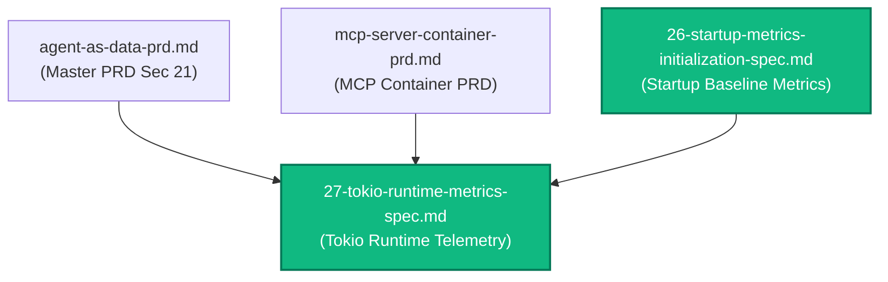
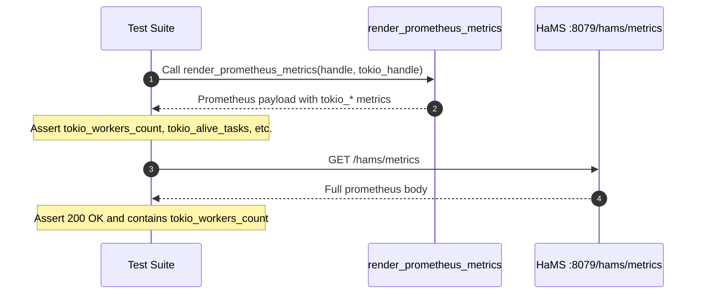

# Spec 27: Tokio Runtime Metrics Telemetry Instrumentation

**Status**: `complete`

---

## Overview & Scope
This specification defines the implementation of **Tokio Runtime Metrics Telemetry Instrumentation** across both `aad-be-container` and `aad-mcp-container`.

To provide deep visibility into asynchronous task scheduling, worker thread saturation, and blocking pool utilization, services compile with the Tokio unstable API flag (`--cfg tokio_unstable`) and capture a reference to the active `tokio::runtime::Handle` in `AppState`.

When Prometheus metrics are scraped via the HaMS health sidecar (`GET /hams/metrics`) or requested via C-FFI callbacks (`prometheus_response_mystate`), the metrics engine dynamically renders the core Prometheus exposition and appends Tokio runtime gauges:
1. `tokio_workers_count`: Total number of worker threads configured in the runtime.
2. `tokio_alive_tasks`: Total count of currently active asynchronous tasks.
3. `tokio_blocking_threads`: Total number of blocking threads allocated in the blocking threadpool.
4. `tokio_idle_blocking_threads`: Number of idle threads in the blocking threadpool.

---

## Dependencies & PRD References
- **PRD Reference**: [Master PRD (Section 21)](../prds/agent-as-data-prd.md)
- **PRD Reference**: [MCP Server Container PRD](../prds/mcp-server-container-prd.md)
- **Architectural Reference**: [09-backend-modular-architecture-spec.md](./09-backend-modular-architecture-spec.md)
- **MCP Architectural Reference**: [23-mcp-server-container-spec.md](./23-mcp-server-container-spec.md)
- **Startup Metrics Reference**: [26-startup-metrics-initialization-spec.md](./26-startup-metrics-initialization-spec.md)



---

## 1. Technical Design & Implementation Details

### 1.1 Unstable Tokio Flag Configuration
Because Tokio runtime metrics requires `tokio_unstable`, local builds and container builds must enable this rustc configuration:
- In `aad-be-container/.cargo/config.toml` and `aad-mcp-container/.cargo/config.toml`:
  ```toml
  [build]
  rustflags = ["--cfg", "tokio_unstable"]
  ```
- In `Dockerfile` stages for both containers, `RUSTFLAGS="--cfg tokio_unstable"` is passed during `cargo chef` and `cargo build`/`cargo test`.

### 1.2 Metric Definitions & Exposition Format
Runtime metrics are appended in standard Prometheus text exposition format:
```prometheus
# HELP tokio_workers_count Number of worker threads
# TYPE tokio_workers_count gauge
tokio_workers_count 4
# HELP tokio_alive_tasks Number of alive tasks
# TYPE tokio_alive_tasks gauge
tokio_alive_tasks 3
# HELP tokio_blocking_threads Number of blocking threads
# TYPE tokio_blocking_threads gauge
tokio_blocking_threads 0
# HELP tokio_idle_blocking_threads Number of idle blocking threads
# TYPE tokio_idle_blocking_threads gauge
tokio_idle_blocking_threads 0
```

### 1.3 Unified Metrics Renderer
In `src/metrics.rs` (in both `aad-be-container` and `aad-mcp-container`), implement `render_prometheus_metrics`:
```rust
pub fn render_prometheus_metrics(
    prometheus_handle: &PrometheusHandle,
    tokio_handle: &tokio::runtime::Handle,
) -> String {
    let mut rendered = prometheus_handle.render();
    if !rendered.ends_with('\n') {
        rendered.push('\n');
    }

    let metrics = tokio_handle.metrics();
    rendered.push_str("# HELP tokio_workers_count Number of worker threads\n");
    rendered.push_str("# TYPE tokio_workers_count gauge\n");
    rendered.push_str(&format!("tokio_workers_count {}\n", metrics.num_workers()));

    rendered.push_str("# HELP tokio_alive_tasks Number of alive tasks\n");
    rendered.push_str("# TYPE tokio_alive_tasks gauge\n");
    rendered.push_str(&format!("tokio_alive_tasks {}\n", metrics.num_alive_tasks()));

    rendered.push_str("# HELP tokio_blocking_threads Number of blocking threads\n");
    rendered.push_str("# TYPE tokio_blocking_threads gauge\n");
    rendered.push_str(&format!("tokio_blocking_threads {}\n", metrics.num_blocking_threads()));

    rendered.push_str("# HELP tokio_idle_blocking_threads Number of idle blocking threads\n");
    rendered.push_str("# TYPE tokio_idle_blocking_threads gauge\n");
    rendered.push_str(&format!("tokio_idle_blocking_threads {}\n", metrics.num_idle_blocking_threads()));

    rendered
}
```

### 1.4 Safe HaMS Closure Hook & C-FFI Compatibility
In `src/lib.rs` (`service_main`), HaMS registers the closure capturing both the `PrometheusHandle` and the `tokio_handle`:
```rust
let handle_clone = Arc::clone(&app_state.prometheus_handle);
let tokio_handle = app_state.tokio_handle.clone();
hams_harness.hams.register_prometheus_closure(move || {
    crate::metrics::render_prometheus_metrics(&handle_clone, &tokio_handle)
}).map_err(|e| format!("Failed to register Prometheus closure with HaMS: {e}"))?;
```
In `src/metrics.rs`, `prometheus_response_mystate` delegates to `render_prometheus_metrics` before creating the C-string pointer.

---

## 2. Test Strategy



### 2.1 Backend (`aad-be-container`) Tests
- **Unit Test (`src/metrics.rs`)**:
  - Test `render_prometheus_metrics` emits `tokio_workers_count`, `tokio_alive_tasks`, `tokio_blocking_threads`, and `tokio_idle_blocking_threads`.
  - Test `prometheus_response_mystate` includes these metrics in the raw pointer buffer.
- **Verification**: `curl http://localhost:8079/hams/metrics` confirms presence of `tokio_workers_count` and other gauges.

### 2.2 MCP Server (`aad-mcp-container`) Tests
- **Unit Test (`src/metrics.rs`)**:
  - Test `render_prometheus_metrics` emits Tokio runtime gauges.
  - Test `prometheus_response_mystate` includes these gauges.
