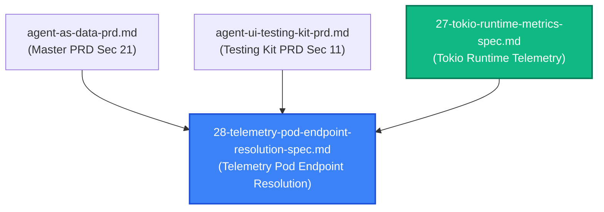
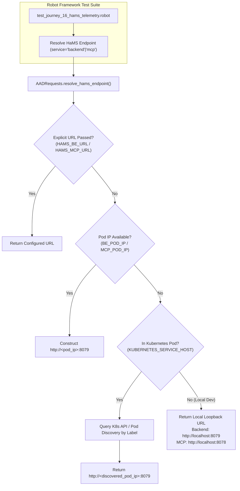
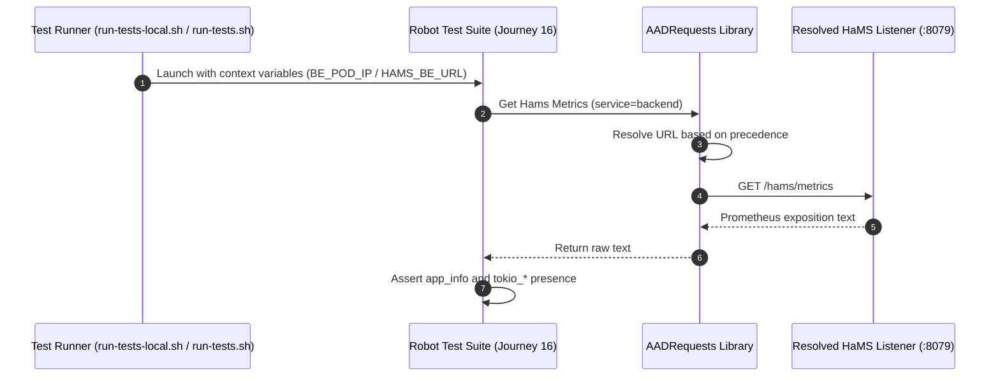

# Spec 28: Test Harness Telemetry & Pod Endpoint Resolution Abstraction

**Status**: `complete`

---

## Overview & Scope
This specification defines the implementation of a unified **Pod Endpoint Resolution Abstraction** for sidecar telemetry (`/hams/metrics`, `/hams/ready`, `/hams/alive`) within the Robot Framework integration test harness (`integration-tests/lib/AADRequests.py` and test runners `run-tests-local.sh` and `run-tests.sh`).

### Problem Statement
In local development environments (`run-tests-local.sh`), all services run on the host workstation (`localhost`), and HaMS telemetry listeners are bound directly to loopback ports (`:8079` for `aad-be-container`, `:8078` for `aad-mcp-container`).

However, in Kubernetes environments (such as Garden integration test runs via `garden.yml`), the test suite executes in a separate pod (`robot-test-runner`). Standard Kubernetes `Service` definitions (`agent-as-data-be:8080`, `agent-as-data-mcp:8080`) only front port `8080` (or `80`), leaving sidecar telemetry on `:8079` unexposed via Service VIPs. Furthermore, even if Service VIPs exposed `:8079`, Kubernetes `kube-proxy` would round-robin requests across replicas, preventing deterministic per-instance assertions of runtime metrics (e.g. `tokio_*`, `app_info`). 

To support both environments cleanly without hardcoded endpoints or brittle test logic, the test harness requires a dedicated endpoint resolution abstraction that transparently delivers the correct target IP and port based on runtime context.

---

## Dependencies & PRD References
- **PRD Reference**: [Master PRD (Section 21)](../prds/agent-as-data-prd.md)
- **PRD Reference**: [Agent UI & Testing Kit PRD (Section 11)](../prds/agent-ui-testing-kit-prd.md)
- **PRD Reference**: [MCP Server Container PRD](../prds/mcp-server-container-prd.md)
- **Startup Metrics Reference**: [26-startup-metrics-initialization-spec.md](./26-startup-metrics-initialization-spec.md)
- **Tokio Runtime Metrics Reference**: [27-tokio-runtime-metrics-spec.md](./27-tokio-runtime-metrics-spec.md)



---

## 1. Technical Design & Architecture



### 1.1 Resolution Precedence & Strategy
The resolution logic for resolving the base URL of a service's HaMS telemetry server follows a strict 4-tier hierarchy:

1. **Direct URL Overrides (`HAMS_BE_URL` / `HAMS_MCP_URL`)**:
   - If explicitly provided via Robot CLI variable (`--variable HAMS_BE_URL:...`) or environment variable, use it directly.
2. **Pod IP Direct Addressing (`BE_POD_IP` / `MCP_POD_IP`)**:
   - If a pod IP is supplied by the test runner (e.g. Garden `run-tests.sh` querying `kubectl get pods -l app=...`), construct `http://<POD_IP>:8079`.
3. **In-Cluster Auto-Discovery**:
   - If executing within a Kubernetes pod (`KUBERNETES_SERVICE_HOST` present) and `podIP` is not explicitly passed, query the Kubernetes API or container environment to obtain the pod IP.
4. **Local Development Default (Workstation Fallback)**:
   - Backend (`aad-be-container`): `http://localhost:8079`
   - MCP (`aad-mcp-container`): `http://localhost:8078`

### 1.2 Library Extensions in `integration-tests/lib/AADRequests.py`
Expose the following Robot keywords in `AADRequests.py`:

```python
def resolve_hams_endpoint(self, service="backend"):
    """
    Resolves the base URL for the HaMS telemetry endpoint of the requested service.
    
    Parameters:
        service (str): 'backend' (or 'be') or 'mcp'.
        
    Returns:
        str: Fully qualified base URL (e.g. 'http://localhost:8079' or 'http://10.244.0.15:8079').
    """

def get_hams_metrics(self, service="backend"):
    """
    Fetches the raw Prometheus metrics payload from the resolved HaMS endpoint.
    
    Returns:
        str: Prometheus exposition formatted text.
    """

def get_hams_health(self, service="backend", endpoint="ready"):
    """
    Checks health status (/hams/alive or /hams/ready).
    
    Returns:
        bool: True if status code is 200, False otherwise.
    """
```

### 1.3 Test Runner Updates

#### `run-tests-local.sh`
Add explicit HaMS local variables to the `robot` invocation:
```bash
"${ROBOT_CMD}" \
    --variable BE_BASE_URL:${LOCAL_BE_URL} \
    --variable FE_BASE_URL:${LOCAL_FE_URL} \
    --variable HAMS_BE_URL:http://localhost:8079 \
    --variable HAMS_MCP_URL:http://localhost:8078 \
    --loglevel DEBUG \
    -d "${REPORT_DIR}" \
    "${TEST_PATH}"
```

#### `run-tests.sh`
Extract both backend and MCP pod IPs and pass them into the runner:
```bash
# Extract backend and MCP pod IPs
BE_POD_IP=$(kubectl get pods -l app=agent-as-data -n $NS -o jsonpath='{.items[0].status.podIP}')
MCP_POD_IP=$(kubectl get pods -l app=agent-as-data-mcp -n $NS -o jsonpath='{.items[0].status.podIP}')
echo "Backend Pod IP: $BE_POD_IP"
echo "MCP Pod IP: $MCP_POD_IP"

# Execute tests with pod IPs and resolved URLs
robot \
    --pythonpath /tmp/robot-tests/lib \
    --pythonpath /tmp/lib \
    --variable BE_POD_IP:$BE_POD_IP \
    --variable MCP_POD_IP:$MCP_POD_IP \
    --variable HAMS_BE_URL:http://${BE_POD_IP}:8079 \
    --variable HAMS_MCP_URL:http://${MCP_POD_IP}:8079 \
    --variable BE_BASE_URL:$BE_BASE_URL \
    --variable FE_BASE_URL:$FE_BASE_URL \
    --loglevel DEBUG \
    -d /tmp/reports \
    /tmp/robot-tests
```

### 1.4 Refactored Journey 16 Test Suite
Update `integration-tests/tests/test_journey_16_hams_telemetry.robot`:
```robot
*** Settings ***
Documentation    Integration test for HaMS Prometheus Telemetry & Tokio Runtime Metrics
Library          ../lib/AADRequests.py
Library          String

*** Test Cases ***
Verify Backend HaMS Metrics Endpoint Responds With Baseline And Tokio Metrics
    [Documentation]    Verify backend /hams/metrics returns baseline app_info and tokio-metrics.
    ${metrics}=    Get Hams Metrics    service=backend
    Should Contain    ${metrics}    app_info
    Should Contain    ${metrics}    name="aad-be-container"
    Should Contain    ${metrics}    tokio_workers_count
    Should Contain    ${metrics}    tokio_live_tasks_count

Verify MCP HaMS Metrics Endpoint Responds With Baseline And Tokio Metrics
    [Documentation]    Verify MCP /hams/metrics returns baseline app_info and tokio-metrics.
    ${metrics}=    Get Hams Metrics    service=mcp
    Should Contain    ${metrics}    app_info
    Should Contain    ${metrics}    name="agent-as-data-mcp"
    Should Contain    ${metrics}    tokio_workers_count
    Should Contain    ${metrics}    tokio_live_tasks_count
```

---

## 2. Test Strategy



### 2.1 Unit Testing
- Author unit tests for `AADRequests.resolve_hams_endpoint()` under `integration-tests/lib/test_aad_requests.py`:
  - Verify default local resolution returns `http://localhost:8079` and `http://localhost:8078`.
  - Verify explicit override `HAMS_BE_URL` takes precedence.
  - Verify `BE_POD_IP` properly formats `http://<ip>:8079`.
  - Verify invalid service identifier raises ValueError.

### 2.2 Integration Verification
- Execute `run-tests-local.sh integration-tests/tests/test_journey_16_hams_telemetry.robot` locally to ensure local execution resolves cleanly.
- Verify `run-tests.sh` syntax and variable propagation for Garden in-cluster runs.
