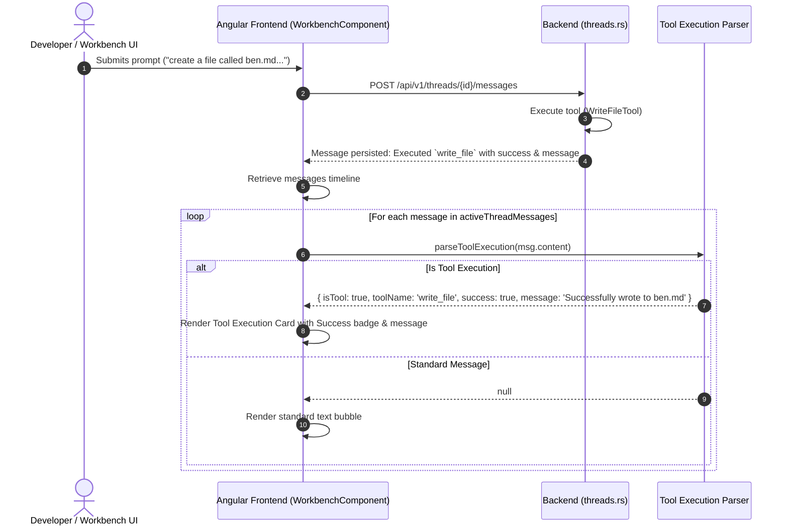

# Spec 30: Workbench Tool Execution Cards UI & Structured Outcome Rendering

**Status**: `complete`

## Overview & Scope
This specification defines the frontend and backend enhancements for **Workbench Tool Execution Cards** within **Agent-As-Data (AAD)** (`aad-fe-container` and `aad-be-container`).

When an agent executes workspace filesystem or memory tools (`write_file`, `replace_in_file`, `delete_file`, `rename_file`, `list_files`, `read_file`, `read_bench_memory`, `update_bench_memory`), previous implementations rendered raw JSON strings inside markdown codeblocks (e.g., `Executed \`write_file\`:\n\`\`\`json\n{"success":true,"message":"Successfully wrote to ben.md"}\n\`\`\``) directly into chat bubbles via `whitespace-pre-wrap`.

This specification formalizes:
1. **Frontend Tool Execution Card Parsing & Rendering**: Automatic recognition of tool execution outcomes in the Workbench chat pane, transforming raw codeblock dumps into elegant, structured **Tool Execution Cards** displaying tool identity, semantic status badges (`Success` / `Failed`), and clear outcome messages.
2. **Backend Normalization & Fallback Formatting**: Clean structured formatting in the backend tool execution pipeline to guarantee human-readable outputs even when downstream LLM summarization times out or fails.
3. **Comprehensive Unit & Integration Test Coverage**: Testing card parsing logic, UI DOM bindings, and end-to-end workbench chat message rendering.

---

## Dependencies & References
- **Build Order Phase**: **Phase 8 (Workbench UX & Structured Tool Visualization)**.
- **Dependencies**:
  - [10-workbench-spec.md](./10-workbench-spec.md) (Workbench File Management & Chat UI)
  - [11-workspace-agent-tool-execution-spec.md](./11-workspace-agent-tool-execution-spec.md) (Workspace Agent Tool Execution & Rig Multi-Turn Integration)
  - [14-workbench-benches-and-threads-ui-navigation-spec.md](./14-workbench-benches-and-threads-ui-navigation-spec.md) (Workbench UI Navigation)
- **PRD References**:
  - [Workspace Tools & Agent Execution PRD](../prds/workspace-filesystem-tools-prd.md)
  - [Workbench Benches, Threads & Workspace Memory PRD](../prds/workbench-bench-thread-prd.md)

---

## Architecture & Rendering Flow



---

## Requirements & Technical Specifications

### 1. Tool Execution Parser Model (`aad-fe-container`)

Define the data structure for parsed tool results:

```typescript
export interface ToolExecutionDetails {
  toolName: string;
  success: boolean;
  message: string;
  rawJson?: string;
}
```

The parser function `parseToolExecution(content: string): ToolExecutionDetails | null` must support:
1. **JSON Codeblock Pattern (Backwards-Compatible)**:
   - Matches messages starting with `Executed \`(\w+)\`:` or containing ```` ```json ... ``` ````.
   - Parses the enclosed JSON object:
     - If `{ "success": boolean, "message": string }` exists, extract `success` and `message`.
     - If `{ "files": string[] }` exists (e.g. `list_files`), format as `Found N files: ...`.
     - If `{ "content": string }` exists (e.g. `read_file`), format as `Read file content (N bytes)`.
2. **Structured Single-Line Pattern**:
   - Matches `Executed \`(\w+)\` \((success|failed)\): (.*)`.
3. **Non-Tool Messages**:
   - Returns `null` for regular user or assistant text messages, preserving normal chat bubble rendering.

### 2. Workbench Chat Template UI Card (`workbench.component.html`)

For assistant messages where `parseToolExecution(msg.content)` returns a valid object:
- **Card Container**:
  - Max width: 85% of timeline container.
  - White background, `rounded-xl`, subtle border `border-slate-200`, shadow `shadow-sm`.
- **Card Header**:
  - Icon container with indigo background (`bg-indigo-50 text-indigo-600`) and icon (`terminal` / `build`).
  - Tool name in monospace font: `font-mono font-semibold text-xs text-slate-800`.
  - Status pill:
    - If `success == true`: Green badge (`bg-emerald-50 text-emerald-700 border border-emerald-200`) with check icon and text `Success`.
    - If `success == false`: Red badge (`bg-rose-50 text-rose-700 border border-rose-200`) with error icon and text `Failed`.
- **Card Body**:
  - Message outcome text in clean typography: `text-xs text-slate-700 leading-relaxed font-normal`.

### 3. Backend Tool Result Formatting Normalization (`aad-be-container/src/webserver/threads.rs`)

In `execute_agent_message`, when a tool execution completes and fallback is required (or summarizer fails/times out):
- Parse `tool_result` output JSON.
- If `{ "success": bool, "message": string }`, format as:
  `Executed \`{tool_name}\` ({status}): {message}`
  where `{status}` is `success` or `failed`.
- This ensures clean human-readable text in logs, CLI responses, and non-UI consumers while remaining seamlessly parseable by the frontend.

---

## Test Strategy

### Unit Tests (`aad-fe-container/src/app/components/workbench/workbench.component.spec.ts`)
1. **`parseToolExecution` - Historical JSON Codeblock**:
   - Input: `Executed \`write_file\`:\n\`\`\`json\n{"success":true,"message":"Successfully wrote to ben.md"}\n\`\`\``
   - Assert returns `{ toolName: 'write_file', success: true, message: 'Successfully wrote to ben.md' }`.
2. **`parseToolExecution` - Failure JSON Codeblock**:
   - Input: `Executed \`delete_file\`:\n\`\`\`json\n{"success":false,"message":"File not found"}\n\`\`\``
   - Assert returns `{ toolName: 'delete_file', success: false, message: 'File not found' }`.
3. **`parseToolExecution` - Standard Messages**:
   - Input: `"Hello, how can I help you today?"`
   - Assert returns `null`.
4. **DOM Rendering Test**:
   - Feed a tool execution message to `activeThreadMessages`.
   - Verify `[data-testid="tool-execution-card"]` is rendered with tool name, success pill, and message.
   - Verify standard message bubble does not render raw JSON.

### Backend Unit Tests (`aad-be-container`)
- Verify `format_tool_execution_result` produces clean structured string for `{ success: true, message: ... }`.

### Integration Tests
- Run `/integration-tests/run-tests-local.sh` and verify all tests pass cleanly.
