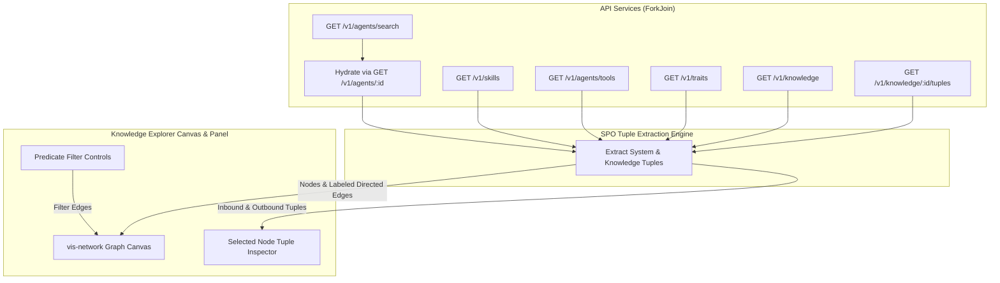

# Spec 32: Knowledge Explorer System Relational Tuples Graph & Inspection UI

**Status**: `complete`

## Overview & Scope
This specification defines the frontend and data-handling implementation for **Knowledge Explorer System Relational Tuples** within **Agent-As-Data (AAD)** (`aad-fe-container`).

In the current implementation of `KnowledgeExplorerComponent` (`/knowledge-explorer`), graph nodes are loaded for agents, skills, tools, traits, and knowledge nodes, but relationships between them are either omitted (e.g. tools have no connecting edges; agents and skills are only partially mapped due to sparse search payloads) or rendered as unlabeled lines without tuple semantics.

This specification formalizes:
1. **Full Entity Hydration**: Ensuring agents and skills are fully hydrated on load so that their relational dependencies (`attached_skills`, `attached_tools`, `attached_agents`, `implements_traits`, and `uses_traits`) are comprehensively available.
2. **Subject-Predicate-Object (SPO) Relational Tuples Extraction**: Standardized extraction of system relational triples across all entity pairs:
   - `(Agent, has_skill, Skill)`
   - `(Agent, uses_tool, Tool)`
   - `(Agent, delegates_to, Agent)`
   - `(Agent, implements, Trait)`
   - `(Agent, requires_trait, Trait)`
   - `(Skill, uses_tool, Tool)`
   - `(Skill, composes_skill, Skill)`
   - `(Skill, implements, Trait)`
   - `(KnowledgeNode, predicate, KnowledgeNode / Concept)` (from `knowledge_tuples` store).
3. **Vis-Network Canvas Tuple Edge Representation**: Direct visual display of predicates on graph edges with directional arrows (`Subject -> Object`), readable edge labels, and formal tuple tooltips `(Subject) —[Predicate]→ (Object)`.
4. **Selected Entity Relational Tuples Inspector**: Inspection drawer panel displaying inbound and outbound relational tuples for any selected entity with quick-jump navigation.
5. **Interactive Predicate Filtering**: Filter controls to toggle visible edge types by predicate.
6. **Comprehensive Unit & Verification Test Suite**: Automated Angular component tests verifying tuple extraction, edge mapping, and user interactions.

---

## Dependencies & References
- **Build Order Phase**: **Phase 15 (Knowledge Explorer & Relational Tuples Graph)**.
- **Dependencies**:
  - [02-knowledge-engine-spec.md](./02-knowledge-engine-spec.md) (SPO Knowledge Graph Store)
  - [03-declarative-agent-registry-spec.md](./03-declarative-agent-registry-spec.md) (Declarative Agents, Skills & Trait Contracts)
  - [08-developer-ui-studio-spec.md](./08-developer-ui-studio-spec.md) (Angular Developer UI Workbench)
  - [29-knowledge-registry-ui-bread-spec.md](./29-knowledge-registry-ui-bread-spec.md) (Knowledge Registry BREAD & Tuples)
- **PRD References**:
  - [Knowledge & Data System PRD](../prds/knowledge-data-system-prd.md) (Section 5)
  - [Agent UI & Testing Kit PRD](../prds/agent-ui-testing-kit-prd.md) (Section 11)

---

## Architecture & Data Flow



---

## Requirements & Technical Specifications

### 1. Relational Tuple Data Model (`knowledge-explorer.component.ts`)

Define explicit TypeScript interfaces for system relational tuples:

```typescript
export interface SystemTuple {
  id: string;
  subjectId: string;
  subjectName: string;
  subjectType: 'agent' | 'skill' | 'tool' | 'trait' | 'knowledge';
  predicate: string;
  objectId: string;
  objectName: string;
  objectType: 'agent' | 'skill' | 'tool' | 'trait' | 'knowledge';
  confidence?: number;
}
```

### 2. Entity Hydration & Graph Construction

1. **Hydration Strategy**:
   - `getAgents()` returns summary objects. For each agent, request `getAgent(id)` in parallel via `forkJoin` (or `catchError` fallback to summary) to retrieve `attached_skills`, `attached_tools`, `attached_agents`, `implements_traits`, and `uses_traits`.
   - Tool list must map IDs and names cleanly (e.g. `tool.id` and `tool.server_name` / `tool.name`).
   - For knowledge nodes, load associated `knowledge_tuples` via `getKnowledgeTuples(node.id)`.

2. **Predicate Extraction Rules**:
   - **Agent -> Skill**: For each `skillId` or `skillName` in `agent.attached_skills`, generate tuple `(Agent, has_skill, Skill)`.
   - **Agent -> Tool**: For each `toolId` or `toolName` in `agent.attached_tools`, generate tuple `(Agent, uses_tool, Tool)`.
   - **Agent -> Agent**: For each `targetAgentId` in `agent.attached_agents`, generate tuple `(Agent, delegates_to, Agent)`.
   - **Agent -> Trait**: For each trait in `agent.implements_traits`, generate tuple `(Agent, implements, Trait)`.
   - **Agent -> Trait (uses)**: For each trait in `agent.uses_traits`, generate tuple `(Agent, requires_trait, Trait)`.
   - **Skill -> Tool**: For each `toolId` in `skill.attached_tools`, generate tuple `(Skill, uses_tool, Tool)`.
   - **Skill -> Skill**: For each `subSkillId` in `skill.attached_skills`, generate tuple `(Skill, composes_skill, Skill)`.
   - **Skill -> Trait**: For each trait in `skill.implements_traits`, generate tuple `(Skill, implements, Trait)`.
   - **Knowledge Nodes**: For each tuple in `knowledge_tuples`, generate tuple `(SourceNode, predicate, TargetNode / Concept)`.

### 3. Canvas Vis-Network Edge Presentation

Graph edges must be configured with explicit tuple visual characteristics:

```typescript
const edge = {
  id: tuple.id,
  from: tuple.subjectId,
  to: tuple.objectId,
  label: tuple.predicate,
  arrows: 'to',
  font: {
    size: 11,
    color: '#64748b',
    align: 'horizontal',
    background: '#ffffff'
  },
  color: {
    color: '#cbd5e1',
    highlight: '#6366f1'
  },
  title: `(${tuple.subjectName}) —[${tuple.predicate}]→ (${tuple.objectName})`,
  smooth: { type: 'continuous' },
  predicate: tuple.predicate
};
```

### 4. Selected Node Relational Tuples Inspector (`knowledge-explorer.component.html`)

When a node is selected (`selectedNode`):
- Compute inbound and outbound tuples for the active entity.
- Display a dedicated **Relational Tuples (SPO Triples)** section in the right drawer:
  - **Outbound Tuples (`[This] —[predicate]→ (Target)`)**:
    - Subject pill (Current node) $\rightarrow$ Predicate badge $\rightarrow$ Target link chip.
  - **Inbound Tuples (`(Source) —[predicate]→ [This]`)**:
    - Source link chip $\rightarrow$ Predicate badge $\rightarrow$ Object pill (Current node).
  - Clicking any connected chip focuses and selects that node in the graph via `network.focus(nodeId)`.
  - Empty state: *"No relational tuples found for this entity."* if no edges connect to the node.

### 5. Predicate Filter Bar (`knowledge-explorer.component.html`)

Add a sleek filter bar directly beneath or inside the top toolbar:
- Quick filter chips: `All`, `has_skill`, `uses_tool`, `delegates_to`, `implements`, `knowledge`.
- Selecting a filter chip hides edges whose predicate does not match, with smooth visual update on `this.edges`.

---

## Test Strategy & Verification Plan

1. **Angular Unit Tests (`knowledge-explorer.component.spec.ts`)**:
   - Verify all entities are loaded and agents are hydrated with full records.
   - Verify tuple extraction generates expected SPO tuples for `has_skill`, `uses_tool`, `implements`, etc.
   - Verify vis-network edges are created with `label`, `arrows: 'to'`, and tooltip `title`.
   - Verify selecting a node populates `inboundTuples` and `outboundTuples`.
   - Verify clicking a predicate filter updates the displayed edges dataset.
2. **End-to-End Visual Verification**:
   - Navigate to `http://localhost:4200/knowledge-explorer` via Chrome DevTools MCP.
   - Verify visible edge labels between agents, skills, and tools.
   - Click an agent node (e.g. `BasicSecurityTest`) and confirm the side panel shows its relational tuples.
   - Verify console is clean with zero runtime exceptions.
