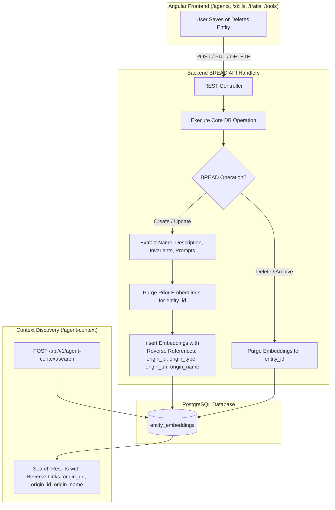

# Spec 34: Automated Entity Embeddings & Reverse References

## Status: `draft`

## Primary PRD References
- [Semantic Search Discovery PRD](../prds/semantic-search-page-prd.md)
- [Agent UI & Testing Kit PRD](../prds/agent-ui-testing-kit-prd.md)
- [Agent Registry & Execution PRD](../prds/agent-registry-execution-prd.md)
- [Skills Registry Tools PRD](../prds/skills-registry-tools-prd.md)

---

## 1. Problem Statement & Architecture Goals
Previously, embedding synchronization was an explicit, manual action triggered via a "Sync Embeddings" button situated on the top navigation bar of the Agent and Skills registry pages. This created three core issues:
1. **Misleading Global Scope**: Placing the button on the top bar made a per-entity action look like a global operation.
2. **Operational Friction & Stale Search**: If a user created, updated, or deleted an agent, skill, trait, or tool without clicking the sync button, the vector database became desynchronized from the primary records.
3. **Missing Reverse References & Orphaned Vectors**: `entity_embeddings` stored generic string identifiers without explicit reverse references (`origin_id`, `origin_type`, `origin_uri`, `origin_name`) or referential integrity constraints, meaning deleted entities could leave orphaned vectors that continued to appear in context discovery search results.

This specification automates the entire entity embeddings lifecycle directly within backend BREAD (Browse, Read, Edit, Add, Delete) handlers for **Agents**, **Skills**, **Traits**, and **Tools**, establishes explicit reverse references on every embedding row with cascading deletes, and removes the redundant manual sync buttons from the UI.

---

## 2. System Architecture & Lifecycle Flow



---

## 3. Database Schema & Migration Specification

### Migration: `0027_entity_embeddings_reverse_references.up.sql`
Add explicit reverse reference columns and cascading referential integrity triggers / columns to `entity_embeddings`:

```sql
-- Migration 0027: Entity Embeddings Reverse References
ALTER TABLE entity_embeddings
    ADD COLUMN IF NOT EXISTS origin_id UUID,
    ADD COLUMN IF NOT EXISTS origin_type VARCHAR(50),
    ADD COLUMN IF NOT EXISTS origin_uri VARCHAR(255),
    ADD COLUMN IF NOT EXISTS origin_name VARCHAR(255);

-- Backfill existing rows
UPDATE entity_embeddings
SET origin_id = entity_id,
    origin_type = entity_type,
    origin_uri = '/' || entity_type || '/' || entity_id::text
WHERE origin_id IS NULL;

-- Create index on reverse references for fast traversal
CREATE INDEX IF NOT EXISTS idx_entity_embeddings_origin ON entity_embeddings(origin_id, origin_type);
```

### Migration: `0027_entity_embeddings_reverse_references.down.sql`
```sql
DROP INDEX IF EXISTS idx_entity_embeddings_origin;
ALTER TABLE entity_embeddings
    DROP COLUMN IF EXISTS origin_id,
    DROP COLUMN IF EXISTS origin_type,
    DROP COLUMN IF EXISTS origin_uri,
    DROP COLUMN IF EXISTS origin_name;
```

---

## 4. Backend BREAD Automated Synchronization Contracts

### 4.1. Shared Embeddings Sync Helper
A centralized backend function in `src/webserver/search.rs` (or `src/services/embeddings.rs`):
```rust
pub async fn sync_entity_embeddings(
    pool: &PgPool,
    entity_id: Uuid,
    entity_type: &str, // "agents", "skills", "traits", "tools"
    entity_name: &str,
    description: Option<&str>,
    additional_fields: &[(&str, &str)], // e.g. [("prompt", prompt_str), ("invariants", inv_str)]
) -> Result<usize, sqlx::Error>
```
1. Deletes previous records: `DELETE FROM entity_embeddings WHERE entity_id = $1`.
2. Inserts `name` fragment with `origin_id`, `origin_type`, `origin_uri = format!("/{}/{}", entity_type, entity_id)`, and `origin_name`.
3. Inserts `description` fragment if non-empty.
4. Inserts any additional text fragments (e.g. prompts, invariants, criteria, tool declarations) with reverse references.
5. Returns total fragments created.

### 4.2. Purge Helper
```rust
pub async fn purge_entity_embeddings(
    pool: &PgPool,
    entity_id: Uuid,
) -> Result<u64, sqlx::Error>
```
Executes `DELETE FROM entity_embeddings WHERE entity_id = $1`.

### 4.3. Entity Handlers Integration
- **Agents (`src/webserver/agents.rs`)**:
  - `create_agent`: Calls `sync_entity_embeddings` for name, description, and `agent_definition`.
  - `update_agent`: Calls `sync_entity_embeddings` with updated fields.
  - `delete_agent`: Calls `purge_entity_embeddings` upon hard delete or soft-delete (archived).
  - `demote_agent`: Purges agent embeddings and calls `sync_entity_embeddings` under `skills`.
- **Skills (`src/webserver/skills.rs`)**:
  - `create_skill`: Calls `sync_entity_embeddings` for name, description, and `definition`.
  - `update_skill`: Calls `sync_entity_embeddings` with updated fields.
  - `delete_skill`: Calls `purge_entity_embeddings`.
  - `promote_skill`: Purges skill embeddings and indexes as `agents`.
- **Traits (`src/webserver/traits.rs`)**:
  - `create_trait`: Calls `sync_entity_embeddings` for name, description, `behavioral_invariants`, `evaluation_criteria`, and `capability_requirements`.
  - `update_trait`: Calls `sync_entity_embeddings` with updated fields.
  - `delete_trait`: Calls `purge_entity_embeddings`.
- **Tools (`src/webserver/tools.rs`)**:
  - `register_tool`: Calls `sync_entity_embeddings` for `server_name` and individual tool names/descriptions parsed from `cached_capabilities`.
  - `sync_tool`: Calls `sync_entity_embeddings` with refreshed tool definitions.
  - `delete_tool`: Calls `purge_entity_embeddings`.

### 4.4. Semantic Search Output Contract (`POST /api/v1/agent-context/search`)
The `SemanticSearchResult` struct is updated to include reverse references:
```rust
#[derive(Debug, Clone, Serialize, Deserialize)]
pub struct SemanticSearchResult {
    pub entity_id: Uuid,
    pub entity_type: String,
    pub name: String,
    pub description: String,
    pub field_name: String,
    pub content: String,
    pub score: f64,
    pub match_reason: String,
    pub origin_id: Uuid,
    pub origin_type: String,
    pub origin_uri: String,
    pub origin_name: String,
}
```

---

## 5. Frontend UI Modifications
1. **Agent Registry View (`agent-registry.component.html`)**:
   - Remove `<button ... (click)="syncEmbeddings()">Sync Embeddings</button>` from the top action bar.
   - Do not render any sync button in the record action bar.
2. **Skills Registry View (`skills-registry.component.html`)**:
   - Remove `<button ... (click)="syncEmbeddings()">Sync Embeddings</button>` from the top action bar.
   - Do not render any sync button in the record action bar.
3. **Traits Registry & Tool Manager Views**:
   - Verify zero "Sync Embeddings" buttons are rendered. (Tool Manager retains "Sync Now" for remote MCP JSON-RPC discovery only).

---

## 6. Comprehensive Test Strategy

### 6.1. Backend Rust Integration Tests
Create test suite in `tests/test_automated_embeddings_lifecycle.rs`:
1. `test_agent_create_auto_syncs_embeddings`: Create an agent via `POST /api/v1/agents`, assert `entity_embeddings` contains rows with `origin_id = agent.id`, `origin_type = 'agents'`, and `origin_uri = '/agents/<id>'`.
2. `test_agent_update_auto_refreshes_embeddings`: Update an agent's description via `PUT /api/v1/agents/{id}`, assert old embeddings are replaced and new keyword is present.
3. `test_agent_delete_purges_embeddings`: Delete an agent via `DELETE /api/v1/agents/{id}`, assert `entity_embeddings` has 0 rows for that `entity_id`.
4. `test_skill_lifecycle_sync`: Create, update, and delete a skill, verifying automatic vector synchronization and purging.
5. `test_trait_lifecycle_sync`: Create, update, and delete a trait, verifying that invariants, evaluation criteria, and capability requirements are automatically indexed and purged.
6. `test_tool_lifecycle_sync`: Register a tool server with mock capabilities, verify individual tools are indexed into `entity_embeddings`, and verify deletion purges them.
7. `test_agent_context_search_returns_reverse_references`: Search for an indexed entity, verify response JSON includes `origin_id`, `origin_type`, `origin_uri`, and `origin_name`.

### 6.2. Robot Framework Integration Tests
Update `integration-tests/tests/test_journey_17_agent_context_search.robot`:
1. **Remove Explicit Sync Step**: In `Test Agent Context Search Roundtrip With Exact Keyword`, remove the step calling `Sync Agent Embeddings`. The test creates the agent and immediately searches for the keyword, confirming automatic backend indexing on write.
2. **Verify Reverse References**: Assert `origin_uri`, `origin_id`, and `origin_name` are present on the search result.
3. **Verify Deletion Purge**: Delete the test agent and assert subsequent context search returns 0 results for the unique keyword.
4. **UI Button Absence Assertion**: Navigate to `/agents` and `/skills` via Browser library and assert that no element containing text "Sync Embeddings" is visible on the page.
