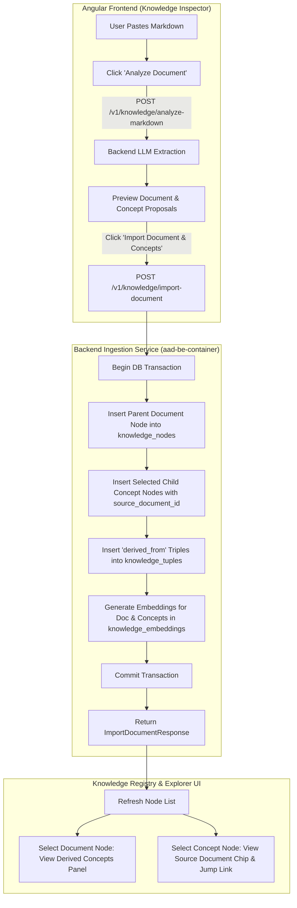

# Spec 35: Knowledge Markdown Document Retention & Bidirectional Concept Provenance

## Status: `complete`

## Primary PRD References
- [Knowledge & Data System PRD](../prds/knowledge-data-system-prd.md)
- [Agent UI & Testing Kit PRD](../prds/agent-ui-testing-kit-prd.md)
- Supersedes / Extends: [33-knowledge-markdown-import-spec.md](./33-knowledge-markdown-import-spec.md)

---

## 1. Problem Statement & Architecture Goals

In Spec 33 ([`33-knowledge-markdown-import-spec.md`](./33-knowledge-markdown-import-spec.md)), the Markdown Import feature was implemented to analyze pasted markdown via an LLM and extract granular concept proposals. However:
1. **Source Discard Vulnerability**: Only the extracted concept nodes were ingested. The original Markdown document text, formatting, headers, tables, and narrative flow were discarded upon dialog completion.
2. **Missing Provenance & Lost Context**: Users and autonomous agents inspecting extracted concept nodes cannot trace them back to the source document or view surrounding contextual explanations.
3. **Graph Disconnection**: Extracted concepts exist as isolated islands in the Knowledge Graph with no structural link to their originating document container.

### Objectives of this Specification
- **Preserve Source Documents**: Ingest the complete, unaltered Markdown text as a primary document node in `knowledge_nodes`.
- **Atomic Bulk Import**: Introduce an atomic backend import endpoint (`POST /v1/knowledge/import-document`) that persists the source document, selected child concepts, and graph relations in a single database transaction.
- **Bidirectional Provenance**:
  - In `knowledge_nodes.metadata`: Store `metadata.source_document_id` on all child concepts and `metadata.child_concept_ids` on the parent document.
  - In `knowledge_tuples`: Generate explicit relational graph triples:
    `(ChildConceptNode, derived_from, SourceDocumentNode)` with `confidence = 1.0`.
- **UI Navigation & Badging**:
  - In the Knowledge Inspector, display a "Source Document" indicator and a "Derived Concepts" index.
  - Provide one-click navigation between source documents and child concepts.
- **Knowledge Explorer Visualization**: Render `derived_from` directed edges in the network canvas (`vis-network`).

---

## 2. System Architecture & Ingestion Flow



---

## 3. Data Model & Metadata Schema

No DDL schema migration is necessary because the existing `knowledge_nodes.metadata` (`JSONB`), `tags` (`TEXT[]`), and `knowledge_tuples` tables natively accommodate this structure.

### 3.1. Parent Source Document Node
- `topic`: Extracted topic or user-assigned topic (e.g. `"architecture"`, `"domain"`, or `"document"`).
- `title`: Extracted from `# Title` header, file name, or LLM proposal.
- `description`: LLM-generated document abstract/summary.
- `tags`: `["document", "imported", <domain_tags>...]`.
- `content`: Complete raw Markdown text intact.
- `metadata`:
  ```json
  {
    "is_source_document": true,
    "source_format": "markdown",
    "content_length": 4096,
    "child_concept_ids": ["uuid-1", "uuid-2"]
  }
  ```

### 3.2. Child Concept Node
- `topic`: Specific domain topic.
- `title`: Concept title.
- `description`: Concept summary.
- `tags`: Specific concept tags.
- `content`: Chunk/section content extracted from the document.
- `metadata`:
  ```json
  {
    "is_extracted_concept": true,
    "source_document_id": "uuid-parent-doc",
    "source_document_title": "Platform Architecture Guide"
  }
  ```

### 3.3. Knowledge Graph Relational Tuples
- `subject`: Child concept title.
- `subject_canonical`: Normalized child concept title.
- `predicate`: `"derived_from"`.
- `object`: Parent document title.
- `object_canonical`: Normalized parent document title.
- `confidence`: `1.0`.
- `source_node_id`: Child concept node UUID.
- `metadata`:
  ```json
  {
    "provenance_type": "markdown_extraction",
    "source_document_id": "uuid-parent-doc",
    "child_concept_id": "uuid-child-concept"
  }
  ```

---

## 4. API Endpoint Contracts

### 4.1. Updated `POST /v1/knowledge/analyze-markdown`
Enriches the LLM prompt to extract both **document-level metadata** and **concept proposals**.

#### Request Payload:
```json
{
  "markdown": "# System Design\n\nThis document outlines...",
  "suggested_topic": "architecture"
}
```

#### Response Payload:
```json
{
  "document": {
    "topic": "architecture",
    "title": "System Design",
    "description": "High-level architectural blueprint for Agent-As-Data system.",
    "tags": ["document", "imported", "architecture"],
    "content": "# System Design\n\nThis document outlines..."
  },
  "proposals": [
    {
      "topic": "architecture",
      "title": "Dual Hybrid Store",
      "description": "PostgreSQL storage combining pgvector and graph tuples.",
      "tags": ["storage", "postgresql", "pgvector"],
      "content": "### Dual Hybrid Store\n\nThe store combines..."
    }
  ]
}
```

### 4.2. New `POST /v1/knowledge/import-document`
Performs atomic bulk persistence of the source document, child concepts, and graph triples.

#### Request Payload:
```json
{
  "document": {
    "topic": "architecture",
    "title": "System Design",
    "description": "High-level architectural blueprint...",
    "tags": ["document", "imported", "architecture"],
    "content": "# System Design\n..."
  },
  "concepts": [
    {
      "topic": "architecture",
      "title": "Dual Hybrid Store",
      "description": "PostgreSQL storage...",
      "tags": ["storage", "postgresql"],
      "content": "..."
    }
  ],
  "create_tuples": true
}
```

#### Response Payload (HTTP 201 Created):
```json
{
  "document": {
    "id": "11111111-1111-1111-1111-111111111111",
    "topic": "architecture",
    "title": "System Design",
    "description": "High-level architectural blueprint...",
    "tags": ["document", "imported", "architecture"],
    "content": "# System Design\n...",
    "metadata": {
      "is_source_document": true,
      "source_format": "markdown",
      "child_concept_ids": ["22222222-2222-2222-2222-222222222222"]
    },
    "created_at": "2026-10-01T16:45:00Z",
    "updated_at": "2026-10-01T16:45:00Z"
  },
  "concepts": [
    {
      "id": "22222222-2222-2222-2222-222222222222",
      "topic": "architecture",
      "title": "Dual Hybrid Store",
      "description": "PostgreSQL storage...",
      "tags": ["storage", "postgresql"],
      "content": "...",
      "metadata": {
        "is_extracted_concept": true,
        "source_document_id": "11111111-1111-1111-1111-111111111111",
        "source_document_title": "System Design"
      },
      "created_at": "2026-10-01T16:45:00Z",
      "updated_at": "2026-10-01T16:45:00Z"
    }
  ],
  "tuples_created": 1
}
```

### 4.3. Enhanced `GET /v1/knowledge/{id}/derived-concepts`
Returns all child concepts associated with a parent document:
```json
[
  {
    "id": "22222222-2222-2222-2222-222222222222",
    "title": "Dual Hybrid Store",
    "topic": "architecture",
    "description": "PostgreSQL storage..."
  }
]
```

---

## 5. Frontend UI/UX Specification (`aad-fe-container`)

### 5.1. Markdown Import Modal
- **Document Header Card**: Shows editable Document Title, Topic, and Description extracted from the markdown.
- **Save Document Toggle**: Checked by default (`[x] Keep original source document in Knowledge Base`).
- **Concept Proposals Checklist**: Retains checkboxes allowing the user to uncheck noisy/redundant proposals.
- **Import Button**: Labeled `"Import Document & X Concepts"` (or `"Import X Concepts Only"` if document toggle unchecked).

### 5.2. Knowledge Inspector Main View
- **Source Document Inspection**:
  - Displays a purple/indigo `"Source Document"` badge.
  - Displays a collapsible `"Derived Concepts (N)"` card in the inspector with clickable chips to jump directly to any extracted child concept.
- **Child Concept Inspection**:
  - Displays a clickable `"Derived from: <Document Title>"` chip leading directly to the source document.
- **Left Sidebar Filtering**:
  - Optional quick filter toggle: `"All" | "Documents" | "Concepts"`.

---

## 6. Comprehensive Test Strategy

### 6.1. Backend Rust Integration Tests (`tests/test_knowledge_document_import.rs`)
1. **`test_analyze_markdown_returns_document_and_proposals`**:
   - Posts a structured markdown text to `/v1/knowledge/analyze-markdown`.
   - Asserts response contains valid `document` object with title, topic, description, and full content.
   - Asserts `proposals` array contains extracted concepts.
2. **`test_import_document_atomic_persistence`**:
   - Posts `ImportDocumentRequest` with 1 document and 2 child concepts.
   - Asserts HTTP 201 response.
   - Queries `knowledge_nodes` to assert parent document exists with `metadata.is_source_document = true`.
   - Queries `knowledge_nodes` to assert child nodes exist with `metadata.source_document_id`.
   - Queries `knowledge_tuples` to assert 2 tuples exist with `predicate = 'derived_from'`.
   - Queries `knowledge_embeddings` to assert vector chunks were created for both parent and children.
3. **`test_import_document_partial_rollback_on_failure`**:
   - Verifies database transaction cleanly rolls back if an invalid node is submitted.

### 6.2. Frontend Angular Unit Tests (`knowledge-inspector.component.spec.ts`)
1. **`should display document summary card and proposals after analysis`**:
   - Mocks `apiService.analyzeMarkdown`.
   - Verifies document title input and proposal list render correctly.
2. **`should call importDocument with document and selected concepts on finalize`**:
   - Verifies payload contains parent document and only checked proposals.
   - Verifies dialog closes and node list reloads on success.
3. **`should render derived concepts panel when source document selected`**:
   - Selects a node with `metadata.is_source_document = true`.
   - Verifies derived concepts list is rendered with links.
4. **`should render source document chip when child concept selected`**:
   - Selects a child node with `metadata.source_document_id`.
   - Verifies chip displays source title and navigation handler is invoked on click.

### 6.3. Robot Framework Integration Tests (`tests/robot/test_knowledge_document_retention.robot`)
1. Ingest markdown document with concepts via `POST /v1/knowledge/import-document`.
2. Verify parent document retrievable via `GET /v1/knowledge/{id}`.
3. Verify child concept retrievable via `GET /v1/knowledge/{id}` and contains `source_document_id`.
4. Verify `GET /v1/knowledge/graph/traverse` discovers the `derived_from` relationship.
5. Verify semantic search `POST /v1/knowledge/search` retrieves hits matching the source document text.
