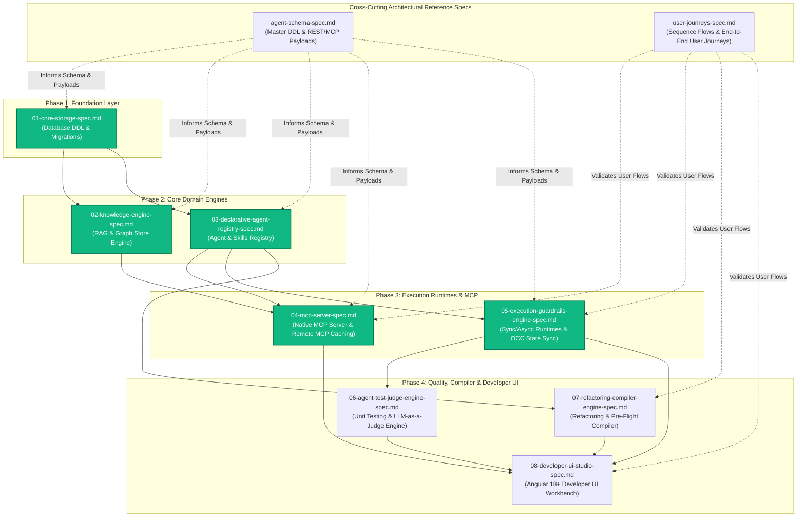

# Task Specifications (Specs) Registry

This directory contains task specifications and historical build snapshots for **Agent-As-Data (AAD)**. 

## Specification Lifecycle & Status Rules
- **Status Types**:
  - `draft`: Spec is under active authoring or refinement. **Modifications are only permitted in `draft` status**.
  - `complete`: Features and test definitions are fully implemented. **Complete specs are immutable** (cannot be modified except to transition to `deprecated`).
  - `deprecated`: Historical spec superseded by a newer specification.
- **Task-Focused & Ephemeral**: Spec files describe specific implementation tasks, schema designs, API contracts, and user journeys.
- **Historical Auditability**: Past specs are preserved to observe what was built and why design choices evolved.

## Implementation Build Order & Dependency Graph

The modular specifications must be implemented in the following strict dependency sequence:

## Index of Task Specifications

| Phase / Scope | Specification Document | Status | Category / Scope | Primary PRD Reference | Dependencies & Role |
| :---: | :--- | :---: | :--- | :--- | :--- |
| **Reference** | [agent-schema-spec.md](./agent-schema-spec.md) | `draft` | Consolidated Schema DDL Reference, Indices, & REST/MCP Payload Specifications | [Master PRD](../prds/agent-as-data-prd.md) | **Cross-Cutting Spec**: Source of truth for database DDL tables and JSON payloads across Phases 1-4 |
| **Reference** | [user-journeys-spec.md](./user-journeys-spec.md) | `draft` | Sequence Diagrams & End-to-End User Journeys (Knowledge, RAG, MCP, Compiler) | [Master PRD](../prds/agent-as-data-prd.md) | **Cross-Cutting Spec**: E2E integration test criteria and sequence flows validating Phases 2-4 |
| **Phase 1** | [01-core-storage-spec.md](./01-core-storage-spec.md) | `complete` | Database DDL Tables, Extension Init (`pgvector`), `sqlx` Migrations, & Seed Engine | [Master PRD](../prds/agent-as-data-prd.md) | Root Phase 1 Spec (Informed by `agent-schema-spec.md`) |
| **Phase 2** | [02-knowledge-engine-spec.md](./02-knowledge-engine-spec.md) | `complete` | Text Chunks RAG, SPO Graph Store, Canonical Entity Resolution, & Pruning | [Knowledge PRD](../prds/knowledge-data-system-prd.md) | Depends on [01-core-storage-spec.md](./01-core-storage-spec.md) |
| **Phase 2** | [03-declarative-agent-registry-spec.md](./03-declarative-agent-registry-spec.md) | `complete` | Declarative Agents, Managed Skills, Skill Promotion, & Trait Verification | [Agent Registry PRD](../prds/agent-registry-execution-prd.md) | Depends on [01-core-storage-spec.md](./01-core-storage-spec.md) |

| **Phase 3** | [04-mcp-server-spec.md](./04-mcp-server-spec.md) | `complete` | Native MCP Server (Stdio/SSE), 11 Tools, & Remote MCP Registration | [Master PRD](../prds/agent-as-data-prd.md) | Depends on [02-knowledge-engine-spec.md](./02-knowledge-engine-spec.md) & [03-declarative-agent-registry-spec.md](./03-declarative-agent-registry-spec.md) |
| **Phase 3** | [05-execution-guardrails-engine-spec.md](./05-execution-guardrails-engine-spec.md) | `complete` | Sync/Async Execution Engine, Guardrails, OCC State Sync, & Webhooks | [Agent Registry PRD](../prds/agent-registry-execution-prd.md) | Depends on [01-core-storage-spec.md](./01-core-storage-spec.md) & [03-declarative-agent-registry-spec.md](./03-declarative-agent-registry-spec.md) |

| **Phase 4** | [06-agent-test-judge-engine-spec.md](./06-agent-test-judge-engine-spec.md) | `draft` | Probabilistic Unit Testing, LLM-as-a-Judge Evaluation, & CI Quality Gates | [Agent Registry PRD](../prds/agent-registry-execution-prd.md) | Depends on [03-declarative-agent-registry-spec.md](./03-declarative-agent-registry-spec.md) & [05-execution-guardrails-engine-spec.md](./05-execution-guardrails-engine-spec.md) |
| **Phase 4** | [07-refactoring-compiler-engine-spec.md](./07-refactoring-compiler-engine-spec.md) | `draft` | Overlap Cluster Refactoring Engine & Pre-Flight Agent Network Compiler | [Agent Registry PRD](../prds/agent-registry-execution-prd.md) | Depends on [03-declarative-agent-registry-spec.md](./03-declarative-agent-registry-spec.md) |
| **Phase 4** | [08-developer-ui-studio-spec.md](./08-developer-ui-studio-spec.md) | `draft` | Angular 18+ Web Dashboard (`aad-fe-container`), Live Testing Workbench, & Graph Visualizer | [Agent UI PRD](../prds/agent-ui-testing-kit-prd.md) | Depends on [04-mcp-server-spec.md](./04-mcp-server-spec.md), [05-execution-guardrails-engine-spec.md](./05-execution-guardrails-engine-spec.md), [06-agent-test-judge-engine-spec.md](./06-agent-test-judge-engine-spec.md), & [07-refactoring-compiler-engine-spec.md](./07-refactoring-compiler-engine-spec.md) |

