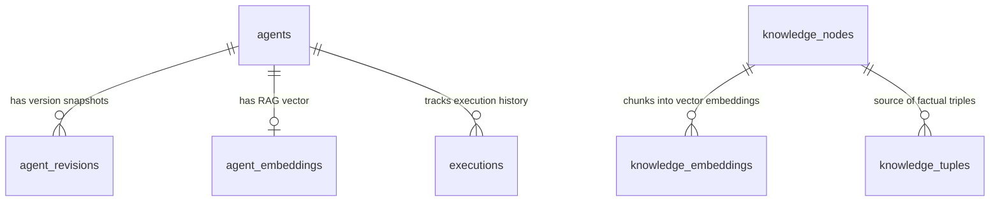

# Agent Schema & Knowledge Store Specification

**Status**: `draft`

## Schema Design (PostgreSQL + pgvector)


```sql
-- Enable vector extension for RAG search
CREATE EXTENSION IF NOT EXISTS vector;

-- Base agents table
CREATE TABLE IF NOT EXISTS agents (
    id UUID PRIMARY KEY DEFAULT gen_random_uuid(),
    name VARCHAR(255) NOT NULL,
    description TEXT,
    tags TEXT[] NOT NULL DEFAULT '{}',
    implements_traits TEXT[] NOT NULL DEFAULT '{}',
    current_version INT NOT NULL DEFAULT 1,
    owner_id UUID NOT NULL,
    read_groups TEXT[] NOT NULL DEFAULT '{}',
    write_groups TEXT[] NOT NULL DEFAULT '{}',
    execute_groups TEXT[] NOT NULL DEFAULT '{}',
    incoming_guardrails JSONB NOT NULL DEFAULT '{}'::jsonb,
    outgoing_guardrails JSONB NOT NULL DEFAULT '{}'::jsonb,
    agent_definition JSONB NOT NULL DEFAULT '{}'::jsonb,
    model JSONB NOT NULL DEFAULT '{}'::jsonb,
    tools JSONB, -- Deprecated, use attached_mcp_servers instead
    available_skills JSONB, -- Deprecated, use attached_skills instead
    available_agents JSONB, -- Deprecated, use attached_agents instead
    attached_skills UUID[] NOT NULL DEFAULT '{}',
    attached_mcp_servers UUID[] NOT NULL DEFAULT '{}',
    attached_agents UUID[] NOT NULL DEFAULT '{}',
    created_at TIMESTAMPTZ NOT NULL DEFAULT NOW(),
    updated_at TIMESTAMPTZ NOT NULL DEFAULT NOW()
);

-- Immutable version history table
CREATE TABLE IF NOT EXISTS agent_revisions (
    id UUID PRIMARY KEY DEFAULT gen_random_uuid(),
    agent_id UUID NOT NULL REFERENCES agents(id) ON DELETE CASCADE,
    version INT NOT NULL,
    snapshot JSONB NOT NULL,
    created_at TIMESTAMPTZ NOT NULL DEFAULT NOW(),
    UNIQUE(agent_id, version)
);

-- RAG Vector Embedding table for semantic agent discovery
CREATE TABLE IF NOT EXISTS agent_embeddings (
    agent_id UUID PRIMARY KEY REFERENCES agents(id) ON DELETE CASCADE,
    embedding vector(1536), -- Standard OpenAI/embedding dimensionality
    content_hash VARCHAR(64) NOT NULL,
    updated_at TIMESTAMPTZ NOT NULL DEFAULT NOW()
);

-- Execution jobs tracking table (Async & audit trail with OCC version locking & webhooks)
CREATE TABLE IF NOT EXISTS executions (
    id UUID PRIMARY KEY DEFAULT gen_random_uuid(),
    agent_id UUID NOT NULL REFERENCES agents(id),
    agent_version INT NOT NULL,
    execution_version INT NOT NULL DEFAULT 1, -- OCC version counter for state sync
    status VARCHAR(50) NOT NULL DEFAULT 'pending',
    working_memory JSONB NOT NULL DEFAULT '{}'::jsonb, -- Persistent working memory snapshot
    request_payload JSONB NOT NULL,
    response_payload JSONB,
    webhook_url TEXT, -- Optional push notification webhook endpoint
    error_message TEXT,
    started_at TIMESTAMPTZ,
    completed_at TIMESTAMPTZ,
    created_at TIMESTAMPTZ NOT NULL DEFAULT NOW()
);


--------------------------------------------------------------------------------
-- Knowledge System Tables (RAG Chunks + Knowledge Graph Tuples)
--------------------------------------------------------------------------------

-- Raw knowledge document / text nodes
CREATE TABLE IF NOT EXISTS knowledge_nodes (
    id UUID PRIMARY KEY DEFAULT gen_random_uuid(),
    topic VARCHAR(255) NOT NULL,
    title VARCHAR(255),
    content TEXT NOT NULL,
    metadata JSONB NOT NULL DEFAULT '{}'::jsonb,
    created_at TIMESTAMPTZ NOT NULL DEFAULT NOW(),
    updated_at TIMESTAMPTZ NOT NULL DEFAULT NOW()
);

-- RAG Vector Embeddings for chunked Knowledge Content
CREATE TABLE IF NOT EXISTS knowledge_embeddings (
    id UUID PRIMARY KEY DEFAULT gen_random_uuid(),
    node_id UUID NOT NULL REFERENCES knowledge_nodes(id) ON DELETE CASCADE,
    chunk_index INT NOT NULL,
    chunk_text TEXT NOT NULL,
    embedding vector(1536),
    created_at TIMESTAMPTZ NOT NULL DEFAULT NOW()
);

-- Knowledge Graph Tuples (Subject - Predicate - Object Relational Store with Canonical Entity Resolution)
CREATE TABLE IF NOT EXISTS knowledge_tuples (
    id UUID PRIMARY KEY DEFAULT gen_random_uuid(),
    subject VARCHAR(255) NOT NULL,
    subject_canonical VARCHAR(255), -- Resolved canonical entity alias
    predicate VARCHAR(255) NOT NULL,
    object VARCHAR(255) NOT NULL,
    object_canonical VARCHAR(255), -- Resolved canonical entity alias
    confidence FLOAT NOT NULL DEFAULT 1.0,
    traversal_count INT NOT NULL DEFAULT 0,
    source_node_id UUID REFERENCES knowledge_nodes(id) ON DELETE CASCADE,
    metadata JSONB NOT NULL DEFAULT '{}'::jsonb,
    created_at TIMESTAMPTZ NOT NULL DEFAULT NOW()
);


-- Indices
CREATE INDEX IF NOT EXISTS idx_agents_name ON agents(name);
CREATE INDEX IF NOT EXISTS idx_agents_tags ON agents USING GIN(tags);
CREATE INDEX IF NOT EXISTS idx_agents_traits ON agents USING GIN(implements_traits);
CREATE INDEX IF NOT EXISTS idx_agent_embeddings_vector ON agent_embeddings USING hnsw (embedding vector_cosine_ops);
CREATE INDEX IF NOT EXISTS idx_knowledge_embeddings_vector ON knowledge_embeddings USING hnsw (embedding vector_cosine_ops);
CREATE INDEX IF NOT EXISTS idx_knowledge_tuples_spo ON knowledge_tuples(subject, predicate, object);
CREATE INDEX IF NOT EXISTS idx_knowledge_tuples_object ON knowledge_tuples(object);

```

## Knowledge API Payload Specifications

### 1. Ingest Knowledge & Extract Tuples (`POST /api/v1/knowledge`)
```json
{
  "topic": "system-architecture",
  "title": "Agent Execution Isolation",
  "content": "Agents run in isolated WebAssembly containers. Security guardrails validate incoming JSON payloads.",
  "tuples": [
    {
      "subject": "Agent",
      "predicate": "runs_in",
      "object": "WebAssembly Container"
    },
    {
      "subject": "Security Guardrail",
      "predicate": "validates",
      "object": "Incoming Payload"
    }
  ]
}
```

### 2. Search Knowledge RAG (`POST /api/v1/knowledge/search`)
```json
// Request
{
  "query": "Where do agents run safely?",
  "n": 2,
  "topic_filter": "system-architecture"
}

// Response
{
  "results": [
    {
      "node_id": "c1eebc99-9c0b-4ef8-bb6d-6bb9bd380a33",
      "chunk_text": "Agents run in isolated WebAssembly containers.",
      "similarity_score": 0.9124
    }
  ]
}
```

### 3. Query Knowledge Graph (`POST /api/v1/knowledge/graph/traverse`)
```json
// Request
{
  "subject": "Agent",
  "max_depth": 2
}

// Response
{
  "tuples": [
    {
      "subject": "Agent",
      "predicate": "runs_in",
      "object": "WebAssembly Container"
    }
  ]
}
```

### 4. Refactor & Analyze Agents (`POST /api/v1/agents/refactor/analyze`)
```json
// Request
{
  "similarity_threshold": 0.85,
  "tag_scope": ["review"]
}

// Response
{
  "analysis": {
    "clusters": [
      {
        "cluster_name": "code-reviewers",
        "agent_ids": [
          "a0eebc99-9c0b-4ef8-bb6d-6bb9bd380a11",
          "b2eebc99-9c0b-4ef8-bb6d-6bb9bd380a44"
        ],
        "findings": [
          {
            "type": "deliberate_contradiction",
            "description": "Agent A (Optimistic Reviewer) and Agent B (Pessimistic Auditor) have contrasting viewpoints.",
            "recommendation": "Harmonize payload contracts and explicitly label contrasting persona intent."
          }
        ]
      }
    ]
  }
}
```

### 5. Visualize Agent Network & Delegation (`GET /api/v1/agents/visualize`)
```json
// Response
{
  "mermaid": "graph TD;\n  code_reviewer[\"Code Reviewer Agent\"] -->|delegates| security_auditor[\"Security Auditor Agent\"];\n  code_reviewer -->|uses_skill| rust_audit[\"Skill: rust-audit v1.0\"];",
  "graph_json": {
    "nodes": [
      { "id": "code_reviewer", "label": "Code Reviewer Agent", "type": "agent" },
      { "id": "security_auditor", "label": "Security Auditor Agent", "type": "agent" },
      { "id": "rust_audit", "label": "Skill: rust-audit v1.0", "type": "skill" }
    ],
    "edges": [
      { "source": "code_reviewer", "target": "security_auditor", "relation": "delegates" },
      { "source": "code_reviewer", "target": "rust_audit", "relation": "uses_skill" }
    ]
  }
}
```

### 6. Verify Agent Contract & Semantic Compatibility (`POST /api/v1/agents/verify-contract`)
```json
// Request
{
  "referring_agent_id": "a0eebc99-9c0b-4ef8-bb6d-6bb9bd380a11",
  "target_agent_id": "b2eebc99-9c0b-4ef8-bb6d-6bb9bd380a44",
  "required_trait": "SecurityAuditor"
}

// Response
{
  "is_compatible": true,
  "semantic_fit_score": 0.9142,
  "trait_contract_valid": true,
  "validation_details": {
    "trait": "SecurityAuditor",
    "schema_match": "passed",
    "guardrails_compatible": true
  }
}
```

### 7. Register Remote MCP Server & Cache Schemas (`POST /api/v1/agents/mcp/register`)
```json
// Request
{
  "server_name": "github-mcp-server",
  "transport_type": "sse",
  "endpoint_config": {
    "url": "https://mcp.github.com/sse"
  }
}

// Response
{
  "server_id": "d3eebc99-9c0b-4ef8-bb6d-6bb9bd380a99",
  "server_name": "github-mcp-server",
  "parsed_tools_count": 14,
  "cached_tools": [
    {
      "name": "create_issue",
      "description": "Create a new GitHub issue",
      "input_schema": {
        "type": "object",
        "properties": {
          "title": { "type": "string" },
          "body": { "type": "string" }
        },
        "required": ["title"]
      }
    }
  ],
  "last_synced_at": "2026-08-07T21:28:00Z"
}
```

-- Agent Test Suites Table
CREATE TABLE IF NOT EXISTS agent_test_suites (
    id UUID PRIMARY KEY DEFAULT gen_random_uuid(),
    agent_id UUID NOT NULL REFERENCES agents(id) ON DELETE CASCADE,
    name VARCHAR(255) NOT NULL,
    test_cases JSONB NOT NULL DEFAULT '[]'::jsonb, -- Array of input payloads, deterministic assertions, and Judge rubrics
    created_at TIMESTAMPTZ NOT NULL DEFAULT NOW()
);

-- Agent Test Runs Table (Audit log for probabilistic and Judge evaluations)
CREATE TABLE IF NOT EXISTS agent_test_runs (
    id UUID PRIMARY KEY DEFAULT gen_random_uuid(),
    agent_id UUID NOT NULL REFERENCES agents(id) ON DELETE CASCADE,
    agent_version INT NOT NULL,
    suite_id UUID REFERENCES agent_test_suites(id) ON DELETE SET NULL,
    status VARCHAR(50) NOT NULL, -- 'passed', 'failed', 'regression_blocked'
    deterministic_results JSONB NOT NULL DEFAULT '{}'::jsonb,
    judge_evaluation JSONB NOT NULL DEFAULT '{}'::jsonb, -- Judge scores (0.0 - 1.0), reasoning breakdown
    created_at TIMESTAMPTZ NOT NULL DEFAULT NOW()
);

-- Agent & Tool Usage Audit Logs Table
CREATE TABLE IF NOT EXISTS agent_usage_logs (
    id UUID PRIMARY KEY DEFAULT gen_random_uuid(),
    agent_id UUID REFERENCES agents(id) ON DELETE SET NULL,
    agent_version INT,
    caller_identity VARCHAR(255) NOT NULL, -- User ID, service account, or parent agent UUID
    tool_calls JSONB NOT NULL DEFAULT '[]'::jsonb, -- Array of tool calls (name, args, duration_ms, status)
    token_metrics JSONB NOT NULL DEFAULT '{}'::jsonb, -- prompt_tokens, completion_tokens, total_tokens, estimated_cost
    guardrail_events JSONB NOT NULL DEFAULT '{}'::jsonb,
    created_at TIMESTAMPTZ NOT NULL DEFAULT NOW()
);

-- Managed Skills Table
CREATE TABLE IF NOT EXISTS skills (
    id UUID PRIMARY KEY DEFAULT gen_random_uuid(),
    name VARCHAR(255) UNIQUE NOT NULL,
    description TEXT NOT NULL,
    tags TEXT[] NOT NULL DEFAULT '{}',
    implements_traits TEXT[] NOT NULL DEFAULT '{}',
    current_version INT NOT NULL DEFAULT 1,
    owner_id UUID NOT NULL,
    read_groups TEXT[] NOT NULL DEFAULT '{}',
    write_groups TEXT[] NOT NULL DEFAULT '{}',
    input_schema JSONB NOT NULL DEFAULT '{}'::jsonb,
    output_schema JSONB NOT NULL DEFAULT '{}'::jsonb,
    implementation JSONB NOT NULL DEFAULT '{}'::jsonb, -- Direct code snippet, script path, or MCP tool mapping
    created_at TIMESTAMPTZ NOT NULL DEFAULT NOW(),
    updated_at TIMESTAMPTZ NOT NULL DEFAULT NOW()
);

-- Indices
CREATE INDEX IF NOT EXISTS idx_agents_name ON agents(name);
CREATE INDEX IF NOT EXISTS idx_agents_tags ON agents USING GIN(tags);
CREATE INDEX IF NOT EXISTS idx_agents_traits ON agents USING GIN(implements_traits);
CREATE INDEX IF NOT EXISTS idx_agent_embeddings_vector ON agent_embeddings USING hnsw (embedding vector_cosine_ops);
CREATE INDEX IF NOT EXISTS idx_knowledge_embeddings_vector ON knowledge_embeddings USING hnsw (embedding vector_cosine_ops);
CREATE INDEX IF NOT EXISTS idx_knowledge_tuples_spo ON knowledge_tuples(subject, predicate, object);
CREATE INDEX IF NOT EXISTS idx_knowledge_tuples_object ON knowledge_tuples(object);
CREATE INDEX IF NOT EXISTS idx_mcp_servers_name ON mcp_servers(server_name);
CREATE INDEX IF NOT EXISTS idx_agent_test_runs_agent ON agent_test_runs(agent_id, agent_version);
CREATE INDEX IF NOT EXISTS idx_agent_usage_logs_agent ON agent_usage_logs(agent_id, created_at);
CREATE INDEX IF NOT EXISTS idx_skills_name ON skills(name);
CREATE INDEX IF NOT EXISTS idx_skills_traits ON skills USING GIN(implements_traits);
```

## Knowledge & Agent API Payload Specifications

### 11. Compile & Validate Agent Network Topology (`POST /api/v1/agents/compile`)
```json
// Request
{
  "root_agent_id": "a0eebc99-9c0b-4ef8-bb6d-6bb9bd380a11",
  "strict_mode": true
}

// Response
{
  "status": "clean", // or "compilation_errors"
  "evaluated_nodes_count": 4,
  "compilation_report": {
    "circular_dependency_check": "passed",
    "schema_contract_matching": "passed",
    "semantic_cohesion_summary": {
      "overall_network_fit_score": 0.924,
      "mismatches_detected": 0
    },
    "diagnostics": []
  }
}
```

## MCP Tools Exposure Schema
Agent-As-Data exposes the following native MCP tools over Stdio and SSE (`/mcp/sse`):
- `search_agents`: Semantic RAG agent discovery.
- `execute_agent`: Hydrate and execute agent.
- `compile_agent_network`: Validate DAG topology, contract schema matching, and semantic cohesion across an agent hierarchy.
- `promote_skill_to_agent`: Promote a single-purpose skill to an autonomous agent.
- `test_agent`: Run agent unit test suites and LLM-as-a-Judge evaluations.
- `register_mcp_server`: Register remote MCP server and cache its tool schemas.
- `verify_agent_contract`: Perform semantic fit & trait contract check between referring and target agents.
- `visualize_agents`: Generate Mermaid flowchart string and JSON graph representation for agent hierarchies.
- `ingest_knowledge`: Store knowledge node & extract tuples.
- `search_knowledge`: Semantic RAG query across captured knowledge.
- `query_knowledge_graph`: Traverse subject-predicate-object tuples.


## Database Entity Relationship Diagram



## Related PRDs
- [Master PRD](../prds/agent-as-data-prd.md)
- [Knowledge System PRD](../prds/knowledge-data-system-prd.md)
- [Agent Registry PRD](../prds/agent-registry-execution-prd.md)


