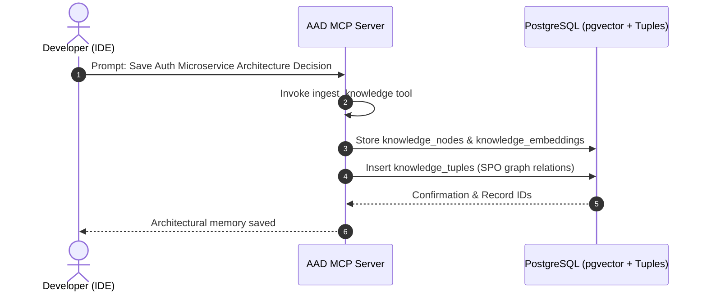
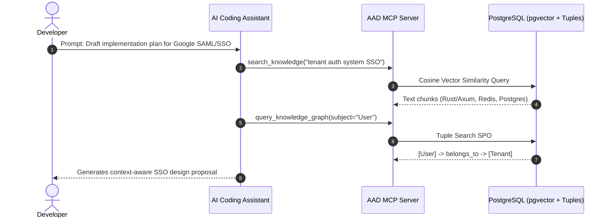
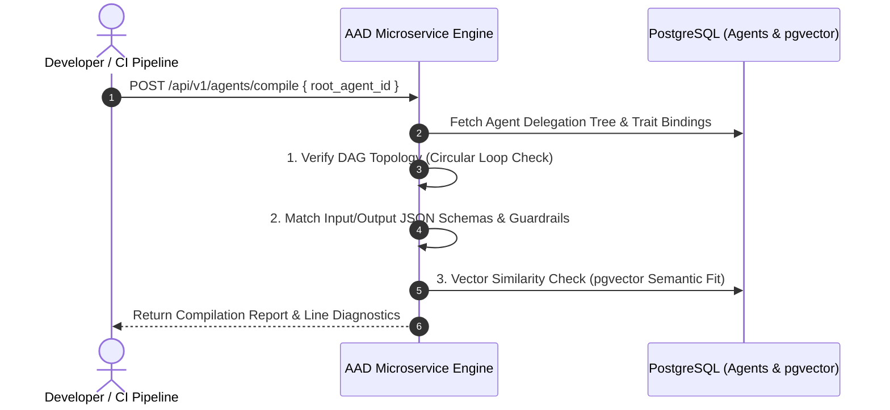

# Agent-As-Data (AAD) - User Journeys & Use Cases

**Status**: `draft`

This document details key end-to-end user journeys illustrating how **Agent-As-Data (AAD)** serves as a persistent **Project Brain**, **RAG/Graph Knowledge Base**, and **Agent Registry & Execution Engine**.


---

## Journey 1: Capturing & Evolving Project Architecture Thoughts (Knowledge Ingestion)

### Scenario
The developer is planning a new microservice architecture in their IDE and wants to capture decisions, thoughts, and entity relationships into their long-term project memory so that future AI coding sessions have complete context.

### Sequence Flow
1. **Developer Input**: In their AI chat interface (e.g. Cursor / Antigravity), the developer types:
   > *"I want to save our decision for the authentication microservice: We will use Rust with Axum, storing session state in Redis and storing user profiles in Postgres. User entities map to Tenant entities via membership tuples."*
2. **MCP Tool Invocation**: The AI Assistant invokes AAD's native MCP tool `ingest_knowledge`:
   ```json
   {
     "topic": "auth-microservice-architecture",
     "title": "Auth Stack & Tenant Mapping Decision",
     "content": "Use Rust + Axum for auth microservice. Session state is stored in Redis key-value store. User profile records are in PostgreSQL. Users are linked to Tenants via membership tuples.",
     "tuples": [
       {"subject": "Auth Microservice", "predicate": "built_with", "object": "Rust Axum"},
       {"subject": "Session State", "predicate": "stored_in", "object": "Redis"},
       {"subject": "User Profile", "predicate": "stored_in", "object": "PostgreSQL"},
       {"subject": "User", "predicate": "belongs_to", "object": "Tenant"}
     ]
   }
   ```
3. **Backend Processing**:
   - Stores raw text and metadata in `knowledge_nodes`.
   - Embeds content into `knowledge_embeddings` via `pgvector`.
   - Records tuples into `knowledge_tuples` for graph query traversal.
4. **Outcome**: The architectural memory is permanently captured and queryable across all future AI tools.

### Journey 1 Sequence Diagram



---

## Journey 2: Conceptualizing New Ideas with RAG + Graph Context (Ideation)

### Scenario
Three weeks later, the developer is starting a new feature (e.g., "Implement Multi-Tenant SSO") and asks their AI assistant for a design proposal. The AI assistant queries AAD to recall historical constraints and relationship graphs before generating code or specs.

### Journey 2 Sequence Diagram



---

## Journey 3: Dynamic Agent Discovery & Execution via Prompt RAG Search

### Scenario
A background CI pipeline or user prompt requires a security review of a pull request. Instead of hardcoding which agent to call, the system queries AAD for the best agent based on task text.

### Sequence Flow
1. **System Request**: API call `POST /api/v1/agents/search-and-execute`:
   ```json
   {
     "query": "Review pull request #42 for Rust security vulnerabilities and unsafe code blocks",
     "n": 1,
     "execution_payload": {
       "diff": "pub unsafe fn raw_pointer_offset(ptr: *const u8, offset: isize) -> u8 { ... }"
     }
   }
   ```
2. **AAD RAG Resolution**:
   - Performs vector cosine similarity against `agent_embeddings`.
   - Matches agent `"rust-security-auditor"` (similarity score 0.94).
3. **Guardrail & Execution Pipeline**:
   - Evaluates `incoming_guardrails` (max payload size, token bounds).
   - Executes agent with target LLM configuration.
   - Evaluates `outgoing_guardrails` (Markdown structure, vulnerability score format).
   - Streams review findings back to client.

---

## Journey 4: Exposing Agents & Knowledge to External AI Assistants via MCP

### Scenario
The developer connects Claude Desktop or a custom agent tool to AAD's local/remote MCP server endpoint (`/mcp/sse` or stdio).

### Sequence Flow
1. **Connection**: External AI tool connects to AAD MCP Server and discovers tools (`search_agents`, `execute_agent`, `ingest_knowledge`, `search_knowledge`, `query_knowledge_graph`).
2. **Cross-Tool Conceptualization**: The user asks Claude Desktop:
   > *"What security tools and agents do we have available in our project brain?"*
3. **Execution**: Claude Desktop calls `search_agents({ "query": "security audit tools", "n": 3 })`, receiving registered agent definitions directly from AAD's database registry.

---

## Journey 5: Pre-Flight Agent Network Compilation & Conceptual Validation

### Scenario
Before deploying a multi-agent workflow to production or executing a complex delegation hierarchy, a developer or CI pipeline runs a compilation check to verify that all sub-agents, traits, schema contracts, and semantic capabilities work together seamlessly.

### Sequence Flow
1. **Compilation Trigger**: In the Developer UI Workbench (`aad-fe-container`) or via CI pipeline, the user clicks **Compile Agent Network** for `root_agent_id: "code-reviewer-orchestrator"`.
2. **Backend Processing (`POST /api/v1/agents/compile`)**:
   - **Layer 1 (DAG Topology)**: Traverses `available_agents` tree to verify there are no circular delegation loops or missing agent/trait UUIDs.
   - **Layer 2 (Contract Matching)**: Verifies that output JSON schemas match incoming JSON schemas and guardrail constraints across all parent-child nodes.
   - **Layer 3 (Semantic Cohesion)**: Runs `pgvector` cosine similarity checks across agent prompts to confirm referenced sub-agents conceptually fit the referring domain.
3. **Outcome**: The compiler emits a clean report or detailed diagnostic warning codes (e.g. `ERR_CIRCULAR_DELEGATION`, `WARN_LOW_SEMANTIC_FIT`, `ERR_SCHEMA_MISMATCH`).

### Journey 5 Sequence Diagram



---

## Journey 6: Managed Skill Creation & Promotion to Autonomous Agent

### Scenario
A developer writes a deterministic, single-purpose routine for formatting JSON logs as a Skill (`skill: "json-log-formatter"`). As requirements grow to include LLM reasoning, vulnerability tagging, and guardrails, the developer promotes the skill into a full declarative Agent.

### Sequence Flow
1. **Developer Guidance Check**: Developer calls `GET /api/v1/skills/guidance?complexity_score=8` and receives recommendation to promote the skill to an Agent.
2. **Promotion Execution**: Developer invokes `POST /api/v1/skills/:id/promote`.
3. **Backend Processing**:
   - Converts `skills` entry into an `agents` record, wrapping implementation in default incoming/outgoing guardrails.
   - Generates initial `agent_revisions` snapshot (v1).
   - Marks original skill as deprecated.
4. **Outcome**: The capability is now available for RAG discovery, autonomous reasoning, and sub-agent delegation.

---

## Journey 7: Probabilistic Unit Testing & LLM-as-a-Judge Evaluation in CI/CD

### Scenario
A developer updates the system prompt of `agent: "security-auditor"`. Before publishing a new revision to production, the CI pipeline runs declarative unit test suites to prevent regressions.

### Sequence Flow
1. **CI Pipeline Trigger**: Calls `POST /api/v1/agents/:id/test`.
2. **Dual Evaluation Execution**:
   - *Deterministic Assertion Phase*: Validates output JSON schemas, required keys, and regex patterns against `agent_test_suites`.
   - *LLM-as-a-Judge Evaluation Phase*: Passes probabilistic text output to a "Judge Agent" which scores output quality against a natural language rubric (0.0 to 1.0).
3. **Regression Gate Check**:
   - Judge score returns `0.92` (exceeds threshold `0.85`).
   - Revision snapshot is approved and published to `agent_revisions`.
   - Test execution results stored in `agent_test_runs`.

---

## Journey 8: Agent Network Refactoring & Deliberate Contradiction Harmonization

### Scenario
An enterprise platform has accumulated 45 registered agents across multiple teams. An architect runs the Refactoring Engine to detect redundant agents and resolve conflicting personas.

### Sequence Flow
1. **Analysis Endpoint**: Architect invokes `POST /api/v1/agents/refactor/analyze { "similarity_threshold": 0.88 }`.
2. **Vector Clustering**: AAD scans `agent_embeddings` and clusters 3 overlapping code reviewer agents.
3. **Contradiction Classification**:
   - Flags 2 redundant agents for merging.
   - Identifies 1 deliberate contradiction (Optimistic Reviewer vs. Pessimistic Auditor).
4. **Harmonization**: Merges duplicate prompt rules into a unified master agent and explicitly labels contrasting persona contracts so they operate harmoniously in sub-agent delegation trees.

---

## Journey 9: Interactive Debugging & Trait Override Testing in Developer UI (`aad-fe-container`)

### Scenario
A developer opens the Web Developer UI Workbench (`http://localhost:8080`) to test an agent's token generation stream and override a sub-agent trait mapping live.

### Sequence Flow
1. **Dashboard Workbench**: Developer navigates to **Interactive Testing Studio** in `aad-fe-container`.
2. **Dynamic Trait Mapping**: Developer selects `Agent: "code-reviewer"` and specifies runtime `trait_mappings: { "SecurityAuditor": "custom_experimental_auditor_uuid" }`.
3. **Contract Pre-Check**: UI calls `POST /api/v1/agents/verify-contract` to verify `custom_experimental_auditor_uuid` satisfies the required `SecurityAuditor` trait schema.
4. **Live SSE Streaming**: Developer clicks **Execute**. The UI opens an SSE connection, streaming token output and rendering live Mermaid network graph updates in real time.

---

## Related PRDs
- [Master PRD](../prds/agent-as-data-prd.md)
- [Knowledge System PRD](../prds/knowledge-data-system-prd.md)
- [Agent Registry PRD](../prds/agent-registry-execution-prd.md)
- [Agent UI & Testing Kit PRD](../prds/agent-ui-testing-kit-prd.md)


